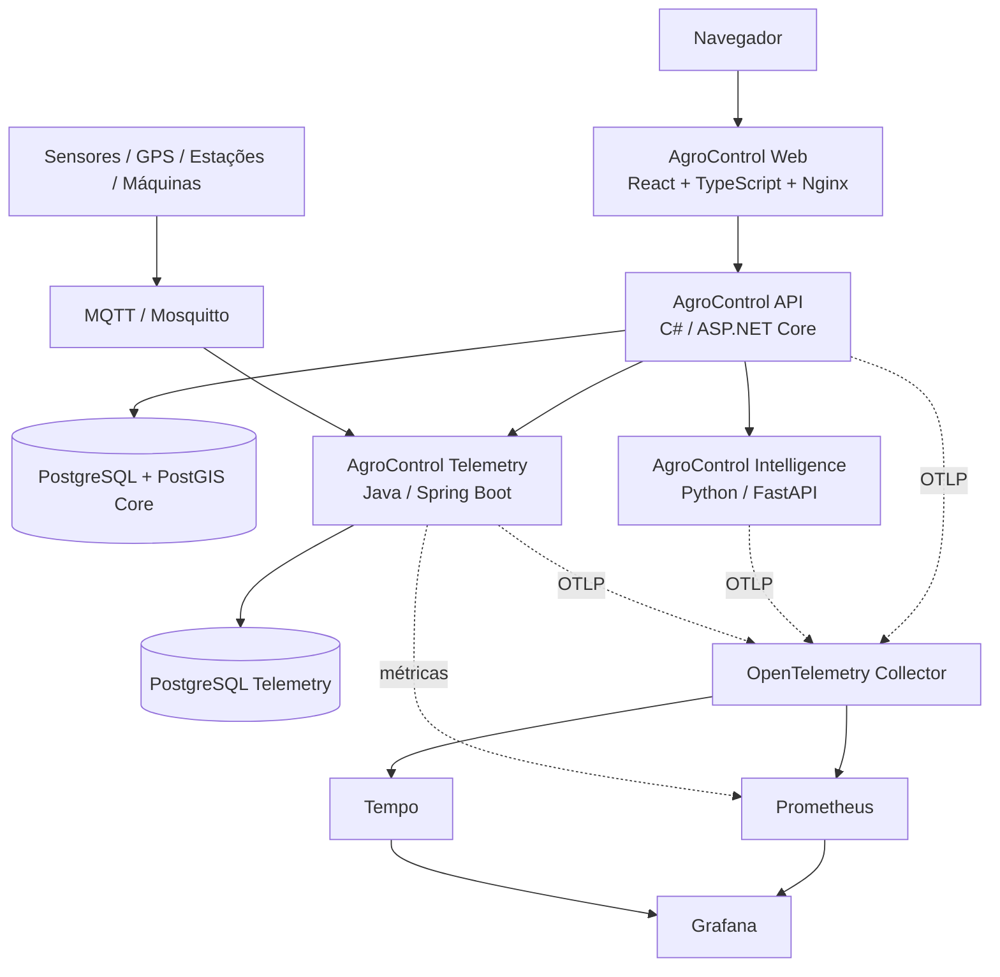

# AgroControl

**AgroControl** é uma plataforma modular de gestão, inteligência e tecnologia para o agronegócio. O núcleo operacional é um **monólito modular em C# / ASP.NET Core**, complementado por **Python / FastAPI** para inteligência, **Java / Spring Boot** para telemetria e uma aplicação web em **React + TypeScript**.

> Status atual: **Sprint 10 concluída — Agricultura de Precisão com PostGIS e talhões georreferenciados**

## Objetivo

Centralizar os principais fluxos de uma operação rural em uma única plataforma:

- propriedades, talhões, culturas e safras;
- limites geográficos de talhões e mapas de agricultura de precisão;
- estoque e movimentações de insumos;
- custos, receitas e rentabilidade;
- máquinas, horímetro, combustível e manutenção;
- commodities e alertas de mercado;
- análise de dados e previsão de produtividade;
- sensores, GPS, estações e telemetria;
- módulos futuros de irrigação, sustentabilidade e exportação.

Os módulos são liberados por plano e o bloqueio é validado no backend, não apenas na interface.

## Stack

| Camada | Tecnologia |
|---|---|
| Web | React 19 + TypeScript 7 + Vite 8 |
| API principal | C# + ASP.NET Core / .NET 10 |
| Banco principal | PostgreSQL 17 + PostGIS + Entity Framework Core |
| Inteligência | Python 3.12 + FastAPI + scikit-learn |
| Telemetria / IoT | Java 21 + Spring Boot |
| Banco de telemetria | PostgreSQL dedicado |
| Mensageria IoT | MQTT + Eclipse Mosquitto |
| Mapas | MapLibre GL + GeoJSON |
| Autenticação | JWT |
| Containers | Docker / Docker Compose |
| Observabilidade | OpenTelemetry + Prometheus + Tempo + Grafana |
| CI/CD | GitHub Actions + GHCR |
| Orquestração | Kubernetes + Kustomize |

## Arquitetura



A aplicação web mantém o navegador no mesmo origin para `/api`; a API concentra identidade, assinatura, autorização, `OrganizationId` e regras centrais. Python cuida de análise/modelagem. Java cuida de ingestão e histórico de telemetria sem escrever diretamente no schema do monólito.

## Funcionalidades implementadas

### AgroControl Web

- registro inicial de organização e usuário;
- login, logout e sessão JWT com expiração;
- rotas privadas;
- contexto de organização, papel, plano e entitlements;
- sidebar e topbar responsivos;
- dashboard com propriedades, área, talhões, safras, estoque baixo e resumo financeiro;
- CRUD web de propriedades, talhões, culturas e safras;
- workspace de agricultura de precisão com mapa e limites de talhões;
- layout para desktop, tablet e mobile;
- proxy reverso same-origin no Nginx.

O frontend melhora a experiência, mas **não substitui as validações de autorização do backend**.

### Plataforma, identidade e multi-tenancy

- Organization, User e membership usuário-organização;
- papéis `Owner`, `Admin`, `Manager` e `Viewer`;
- cadastro e login com JWT;
- PBKDF2-HMAC-SHA512 com salt aleatório;
- planos `Basic`, `Pro`, `Intelligence` e `Enterprise`;
- entitlements e overrides por organização;
- isolamento por `OrganizationId` e bloqueio de módulos no backend.

### Produção rural

- propriedades (`Farm`), talhões (`Field`), culturas (`Crop`) e safras (`Season`);
- CRUD, soft delete, paginação, busca e filtros;
- validações de área, datas e produtividade;
- produtividade esperada e realizada por hectare.

### Agricultura de precisão

- PostGIS no banco principal;
- limite opcional do talhão como `geography(Polygon,4326)`;
- contrato GeoJSON e validação WGS84;
- índice espacial GiST;
- cálculo geodésico de área em hectares no PostgreSQL;
- comparação entre área georreferenciada e área cadastral sem alteração silenciosa;
- leitura, cadastro, redesenho e remoção de limites;
- isolamento por organização e proteção pelo entitlement `PrecisionAgriculture`;
- mapa MapLibre configurável por ambiente.

### Estoque

- categorias, itens, SKU, unidades e depósitos;
- entradas, saídas e ajustes em ledger append-only;
- saldo por item/depósito e bloqueio de estoque negativo;
- lote, validade, consumo por propriedade/talhão/safra e alertas de estoque baixo.

### Financeiro

- categorias e centros de custo;
- despesas, receitas, contas a pagar e receber;
- competência, vencimento e liquidação;
- vínculo com propriedade, talhão e safra;
- resultado, margem, fluxo de caixa, custo/ha, custo por unidade e ponto de equilíbrio.

### Máquinas e mercado

- máquinas, implementos, horímetro, combustível e manutenção;
- manutenção preventiva/corretiva e custos por máquina;
- commodities por organização;
- cotações append-only, variação e alertas por preço-alvo;
- contrato preparado para provedores externos de mercado.

### AgroControl Intelligence

- serviço Python independente com FastAPI;
- contrato HTTP versionado `v1`;
- baseline por produtividade esperada ou média histórica;
- regressão Ridge comparada ao baseline;
- MAE/RMSE quando existe histórico suficiente;
- retorno explícito `insufficient_data` quando não há base confiável;
- cliente HTTP tipado, timeout e tratamento de indisponibilidade;
- isolamento multi-tenant antes da chamada ao serviço.

A previsão é **apoio à decisão** e não substitui avaliação agronômica profissional nem representa garantia de produtividade.

### AgroControl Telemetry

- Java 21 + Spring Boot com PostgreSQL próprio;
- dispositivos por organização e vínculos opcionais com máquina, propriedade e talhão;
- eventos append-only e idempotência por `deviceId + eventId`;
- última leitura e histórico por período/métrica;
- MQTT com QoS 1 e reconexão automática;
- tópico `agrocontrol/v1/devices/{deviceId}/telemetry`;
- API interna com credencial serviço-a-serviço;
- endpoints externos protegidos por JWT + entitlement `Telemetry`.

### DevOps e observabilidade

- OpenTelemetry na API C#, Intelligence Python e Telemetry Java;
- traces distribuídos, logs JSON, liveness/readiness;
- OpenTelemetry Collector, Tempo, Prometheus e Grafana em profile opcional;
- pipelines independentes para backend, Intelligence, Telemetry, frontend e plataforma integrada;
- Dependabot para NuGet, pip, Maven, npm e GitHub Actions;
- CodeQL para C#, Java/Kotlin, Python e JavaScript/TypeScript;
- publicação das quatro imagens no GHCR por SHA/SemVer com provenance e SBOM;
- Kubernetes com Kustomize, probes, resources, security context e PDB.

## Executando localmente

```bash
cp .env.example .env
docker compose up --build
```

Serviços padrão:

```text
AgroControl Web          http://localhost:3001
AgroControl API          http://localhost:8080
AgroControl Intelligence http://localhost:8090
AgroControl Telemetry    http://localhost:8100
PostgreSQL + PostGIS     localhost:5432
PostgreSQL Telemetry     localhost:5433
MQTT / Mosquitto         localhost:1883
```

Para ativar observabilidade:

```bash
OTEL_ENABLED=true docker compose --profile observability up --build
```

## Health checks

```text
API          GET /health/live
API          GET /health/ready
Intelligence GET /health/live
Intelligence GET /health/ready
Telemetry    GET /actuator/health/liveness
Telemetry    GET /actuator/health/readiness
Telemetry    GET /actuator/prometheus
Web          GET /
```

## Endpoints principais

```text
POST /api/v1/auth/register
POST /api/v1/auth/login
GET  /api/v1/me
GET  /api/v1/organizations/current
GET  /api/v1/platform/entitlements

/api/v1/farms
/api/v1/fields
/api/v1/crops
/api/v1/seasons
/api/v1/precision/*
/api/v1/inventory/*
/api/v1/finance/*
/api/v1/machinery/*
/api/v1/market/*
POST /api/v1/intelligence/seasons/{seasonId}/yield-prediction
/api/v1/telemetry/*
```

## Kubernetes

A base fica em `k8s/` e pode ser renderizada com `kubectl kustomize k8s/base` e `kubectl kustomize k8s/overlays/local`. Segredos reais não entram no repositório.

## Qualidade e CI/CD

- **Backend CI:** PostgreSQL 17 + PostGIS, restore, build e testes .NET;
- **Intelligence CI:** Ruff, pytest, imagem e smoke test;
- **Telemetry CI:** Maven, PostgreSQL 17, imagem e MQTT ponta a ponta;
- **Frontend CI:** `npm ci`, type-check, Vitest, build, imagem e smoke test;
- **Platform CI:** Docker Compose completo, web, PostGIS, observabilidade, Kustomize e smoke tests integrados;
- **CodeQL:** C#, Java/Kotlin, Python e JavaScript/TypeScript;
- **Dependabot:** NuGet, pip, Maven, npm e GitHub Actions.

## Documentação

- [`docs/SPRINT_6_INTELLIGENCE.md`](docs/SPRINT_6_INTELLIGENCE.md)
- [`docs/SPRINT_7_TELEMETRY.md`](docs/SPRINT_7_TELEMETRY.md)
- [`docs/SPRINT_8_PLATFORM_DEVOPS.md`](docs/SPRINT_8_PLATFORM_DEVOPS.md)
- [`docs/SPRINT_9_WEB.md`](docs/SPRINT_9_WEB.md)
- [`docs/SPRINT_10_PRECISION_AGRICULTURE.md`](docs/SPRINT_10_PRECISION_AGRICULTURE.md)
- [`docs/ROADMAP.md`](docs/ROADMAP.md)

## Roadmap resumido

1. ✅ **Sprint 0** — fundação, arquitetura, CI e containers.
2. ✅ **Sprint 1** — identidade, organizações e autorização por módulo.
3. ✅ **Sprint 2** — produção rural.
4. ✅ **Sprint 3** — estoque.
5. ✅ **Sprint 4** — financeiro e rentabilidade.
6. ✅ **Sprint 5** — máquinas e mercado.
7. ✅ **Sprint 6** — Python / Intelligence.
8. ✅ **Sprint 7** — Java / Telemetry / MQTT.
9. ✅ **Sprint 8** — observabilidade, CI/CD, segurança operacional e Kubernetes.
10. ✅ **Sprint 9** — AgroControl Web, autenticação, dashboard e produção rural no navegador.
11. ✅ **Sprint 10** — PostGIS, GeoJSON, talhões georreferenciados e mapas.

O hardening que depende de ambiente real, política operacional ou testes de carga está separado no issue **#18**.

## Segurança

Defaults do repositório são apenas de desenvolvimento. Em produção, `JWT_KEY`, `TELEMETRY_INTERNAL_API_KEY`, credenciais de banco e credenciais/certificados MQTT devem vir de secrets management apropriado.

O mapa usa URLs configuráveis e não exige segredo no frontend. Caso um provedor de tiles exija credenciais, elas não devem ser tratadas como segredo confiável quando expostas ao navegador; aplique restrições por domínio/quota ou um backend apropriado conforme o provedor.

O JWT do frontend usa `sessionStorage` por compatibilidade com o contrato bearer atual. A evolução para BFF/cookie HttpOnly pode ser adotada quando a exposição pública e o modelo de sessão justificarem esse endurecimento.

## Licença

A licença ainda não foi definida. Não adicione licença pública ao projeto sem decidir antes o modelo de distribuição do AgroControl.
