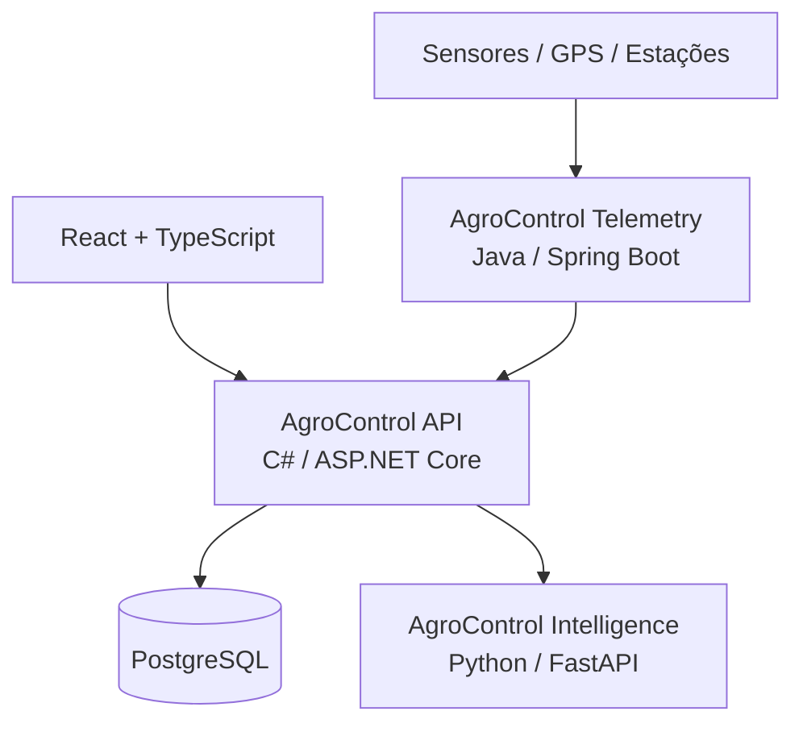

# AgroControl

**AgroControl** é uma plataforma modular para gestão e inteligência no agronegócio. O projeto foi desenhado para começar como um **monólito modular em C# / ASP.NET Core**, mantendo pontos claros de integração com serviços especializados em **Python** (dados, IA e visão computacional) e **Java** (telemetria e IoT).

> Status atual: **Sprint 0 — Fundação do projeto**

## Objetivo

Centralizar, em uma única plataforma, os principais fluxos de uma operação rural:

- gestão de propriedades e talhões;
- culturas e safras;
- estoque de insumos;
- custos e resultado financeiro;
- máquinas e manutenção;
- mercado e commodities;
- agricultura de precisão;
- análise de dados e IA;
- irrigação e sensores;
- sustentabilidade e carbono;
- exportação.

Os módulos podem ser liberados por plano. Recursos indisponíveis continuam visíveis na interface como **bloqueados** ou **em breve**, mas o bloqueio também deve ser aplicado no backend.

## Stack planejada

| Camada | Tecnologia |
|---|---|
| Frontend | React + TypeScript |
| API principal | C# + ASP.NET Core |
| Banco de dados | PostgreSQL |
| ORM | Entity Framework Core |
| Inteligência / Dados | Python + FastAPI |
| Telemetria / IoT | Java + Spring Boot |
| Autenticação | JWT / OpenID Connect |
| Containers | Docker / Docker Compose |
| Orquestração futura | Kubernetes |
| CI/CD | GitHub Actions |
| Observabilidade futura | OpenTelemetry + Grafana |

## Arquitetura



A API principal começa como um **monólito modular**. Python e Java só entram como serviços independentes quando houver uma justificativa técnica real.

## Estrutura do repositório

```text
agrocontrol/
├── .github/
│   ├── ISSUE_TEMPLATE/
│   ├── workflows/
│   └── pull_request_template.md
├── docs/
│   ├── adr/
│   ├── API_CONVENTIONS.md
│   ├── ARCHITECTURE.md
│   ├── DOMAIN.md
│   ├── GITHUB_WORKFLOW.md
│   ├── MODULES.md
│   └── ROADMAP.md
├── services/
│   ├── intelligence/        # Python — fase futura
│   └── telemetry/           # Java — fase futura
├── src/
│   ├── backend/
│   │   ├── AgroControl.Api/
│   │   ├── AgroControl.Application/
│   │   ├── AgroControl.Domain/
│   │   └── AgroControl.Infrastructure/
│   └── frontend/            # React — fase futura
├── tests/
│   ├── backend/
│   ├── intelligence/
│   └── telemetry/
├── .editorconfig
├── .env.example
├── .gitattributes
├── .gitignore
├── AgroControl.sln
└── docker-compose.yml
```

## Módulos

### MVP

- Identity
- Organizations
- Farms
- Fields
- Crops
- Seasons
- Inventory
- Finance

### Em seguida

- Machinery
- Market

### Planejados / bloqueados inicialmente

- Precision Agriculture
- Intelligence
- Irrigation
- Sustainability
- Export
- Telemetry / IoT

Veja [`docs/MODULES.md`](docs/MODULES.md) para o catálogo completo.

## Convenções principais

- API versionada em `/api/v1/...`;
- nomes internos do código em inglês;
- documentação funcional pode permanecer em português;
- `Guid` como identificador principal das entidades de negócio;
- UTC para timestamps;
- valores monetários com `decimal`;
- módulos validados no backend, nunca apenas ocultados no frontend;
- regras de negócio no domínio/aplicação, não nos controllers.

## Executando com Docker

A estrutura já contém Docker Compose com PostgreSQL e a API.

1. Copie `.env.example` para `.env`.
2. Ajuste as variáveis se necessário.
3. Execute:

```bash
docker compose up --build
```

A API ficará disponível em:

```text
http://localhost:8080
```

Health check:

```text
GET http://localhost:8080/health
```

Catálogo inicial de módulos:

```text
GET http://localhost:8080/api/v1/platform/modules
```

> O banco ainda não está conectado à aplicação na Sprint 0. Entity Framework Core entra no próximo sprint junto com as primeiras entidades persistidas.

## Roadmap resumido

1. **Sprint 0** — fundação, documentação, arquitetura, CI e containers.
2. **Sprint 1** — identidade, organizações e autorização por módulo.
3. **Sprint 2** — propriedades, talhões, culturas e safras.
4. **Sprint 3** — estoque.
5. **Sprint 4** — financeiro.
6. **Sprint 5** — máquinas e mercado.
7. **Sprint 6** — serviço Python de inteligência.
8. **Sprint 7** — serviço Java de telemetria.
9. **Sprint 8** — observabilidade, CI/CD avançado e Kubernetes.

Detalhes em [`docs/ROADMAP.md`](docs/ROADMAP.md).

## Estado da Sprint 0

- [x] arquitetura definida;
- [x] estrutura de pastas definida;
- [x] solução .NET criada em formato de scaffold;
- [x] endpoint de health check;
- [x] catálogo inicial de módulos;
- [x] Dockerfile da API;
- [x] Docker Compose com PostgreSQL;
- [x] documentação inicial;
- [x] workflow inicial de CI;
- [ ] primeiro domínio persistido com EF Core;
- [ ] autenticação;
- [ ] frontend.

## Licença

A licença ainda não foi definida. Não adicione uma licença pública ao projeto sem decidir antes o modelo de distribuição do AgroControl.
