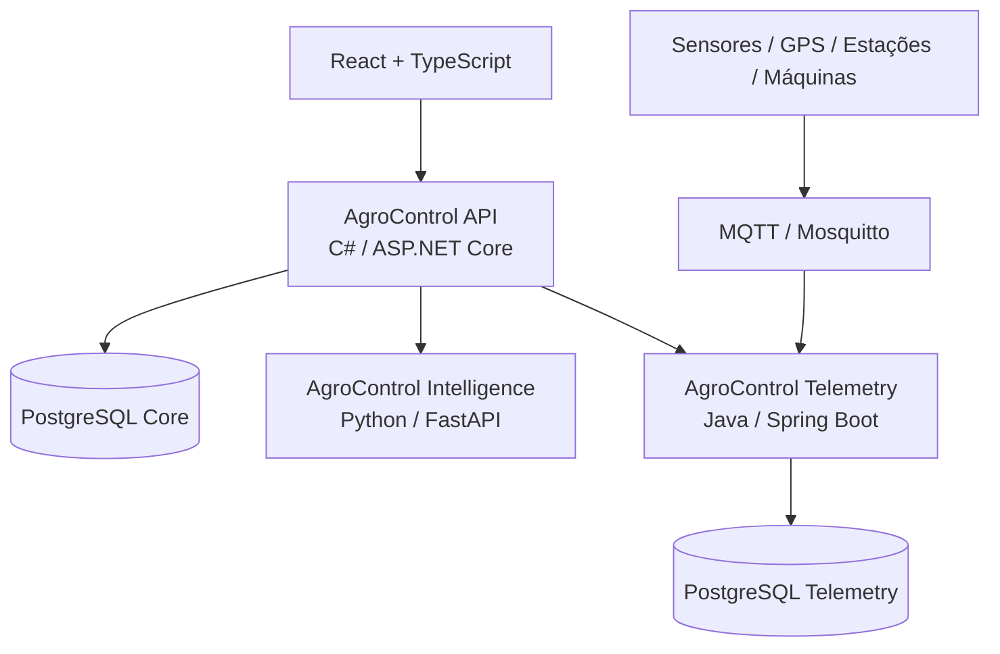

# AgroControl

**AgroControl** é uma plataforma modular para gestão, inteligência e tecnologia no agronegócio. O núcleo operacional permanece como um **monólito modular em C# / ASP.NET Core**, enquanto responsabilidades tecnicamente distintas são isoladas em serviços especializados: **Python / FastAPI** para inteligência de dados e **Java / Spring Boot** para telemetria e IoT.

> Status atual: **Sprint 7 concluída — AgroControl Telemetry, MQTT e integração C# ↔ Java**

## Objetivo

Centralizar os principais fluxos de uma operação rural em uma única plataforma, sem transformar o projeto prematuramente em uma arquitetura de microserviços complexa:

- propriedades, talhões, culturas e safras;
- estoque e movimentações de insumos;
- custos, receitas e rentabilidade;
- máquinas, horímetro, combustível e manutenção;
- commodities e alertas de mercado;
- análise de dados e previsão de produtividade;
- sensores, GPS, estações e telemetria;
- agricultura de precisão, irrigação, sustentabilidade e exportação em fases posteriores.

Os módulos são liberados por plano e o bloqueio é validado no backend, não apenas na interface.

## Stack

| Camada | Tecnologia |
|---|---|
| Frontend | React + TypeScript (planejado) |
| API principal | C# + ASP.NET Core / .NET 10 |
| Banco principal | PostgreSQL + Entity Framework Core |
| Inteligência | Python 3.12 + FastAPI + scikit-learn |
| Telemetria / IoT | Java 21 + Spring Boot |
| Banco de telemetria | PostgreSQL dedicado |
| Mensageria IoT | MQTT + Eclipse Mosquitto |
| Autenticação de usuário | JWT |
| Comunicação interna | HTTP tipado + credencial serviço-a-serviço |
| Containers | Docker / Docker Compose |
| CI/CD | GitHub Actions |
| Observabilidade | OpenTelemetry + Grafana (Sprint 8) |
| Orquestração | Kubernetes somente quando houver justificativa operacional |

## Arquitetura



A API principal é responsável por identidade, assinatura, autorização, `OrganizationId` e regras centrais de negócio. O serviço Python possui a responsabilidade de análise/modelagem. O serviço Java possui a responsabilidade de ingestão, normalização e histórico de telemetria e **não escreve diretamente no schema do monólito**.

## O que já funciona

### Plataforma e segurança

- solução .NET 10 separada em Domain, Application, Infrastructure e API;
- PostgreSQL com EF Core e migrations;
- Organization, User e membership usuário-organização;
- papéis `Owner`, `Admin`, `Manager` e `Viewer`;
- cadastro e login com JWT;
- PBKDF2-HMAC-SHA512 com salt aleatório para senha;
- planos `Basic`, `Pro`, `Intelligence` e `Enterprise`;
- entitlements e overrides por organização;
- bloqueio de módulos no backend;
- isolamento multi-tenant por `OrganizationId`.

### Produção Rural

- propriedades (`Farm`), talhões (`Field`), culturas (`Crop`) e safras (`Season`);
- CRUD, soft delete, paginação, busca e filtros;
- validações de área, datas e produtividade;
- produtividade esperada e realizada por hectare.

### Estoque

- categorias, itens, SKU, unidades de medida e depósitos;
- entradas, saídas e ajustes em ledger append-only;
- saldo por item/depósito e bloqueio de estoque negativo;
- lote, validade e consumo associado à propriedade, talhão ou safra;
- alertas de estoque baixo.

### Financeiro

- categorias financeiras e centros de custo;
- despesas, receitas, contas a pagar e receber;
- competência, vencimento e liquidação;
- vínculo com propriedade, talhão e safra;
- receitas, despesas, resultado, margem e fluxo de caixa;
- custo por hectare, custo por unidade produzida e ponto de equilíbrio.

### Máquinas e manutenção

- máquinas e implementos;
- status operacional;
- histórico de horímetro sem regressão;
- abastecimentos e custo de combustível;
- manutenção preventiva e corretiva;
- custos acumulados e custo por hora rastreada;
- próxima manutenção por data e/ou horímetro.

### Mercado e commodities

- commodities por organização;
- histórico append-only de cotações;
- moeda, unidade, fonte e timestamp;
- última cotação e variação absoluta/percentual;
- alertas de preço acima/abaixo do alvo;
- contrato preparado para provedores externos.

### AgroControl Intelligence

- serviço Python independente com FastAPI;
- contrato HTTP versionado `v1`;
- baseline por produtividade esperada ou média histórica;
- regressão Ridge comparada ao baseline;
- MAE e RMSE quando há histórico suficiente;
- `insufficient_data` quando não existe base confiável para estimativa;
- dataset montado no C# e limitado à mesma organização e cultura;
- cliente HTTP tipado, timeout e tratamento de indisponibilidade;
- Docker e CI próprio.

A previsão é **apoio à decisão** e não substitui avaliação agronômica profissional nem representa garantia de produtividade.

### AgroControl Telemetry

- serviço Java 21 + Spring Boot independente;
- banco PostgreSQL próprio;
- cadastro de dispositivos por organização;
- tipos iniciais para máquina, GPS, estação meteorológica e sensor de campo;
- vínculos opcionais com máquina, propriedade e talhão;
- eventos de telemetria append-only;
- idempotência por `deviceId + eventId`;
- última leitura e histórico por período/métrica;
- consumidor MQTT com QoS 1 e reconexão automática;
- tópico versionado `agrocontrol/v1/devices/{deviceId}/telemetry`;
- validação de timestamp, valor, unidade, coordenadas, metadata e tamanho de payload;
- API interna protegida por credencial serviço-a-serviço;
- endpoints públicos do AgroControl protegidos por JWT + entitlement `Telemetry`;
- tenant MQTT resolvido pelo dispositivo registrado, nunca confiando em um `OrganizationId` arbitrário no payload;
- Docker Compose com Eclipse Mosquitto e PostgreSQL dedicado;
- OpenAPI / Swagger UI no serviço Java.

O broker Mosquitto do repositório é **somente para desenvolvimento**. Produção exige TLS, identidade por dispositivo/gateway, ACLs de tópico, rotação de credenciais, rate limiting e observabilidade apropriada. O AgroControl não implementa controle remoto de máquinas nesta fase.

## Módulos e planos

### Basic

Identity, Organizations, Farms, Fields, Crops, Seasons, Inventory e Finance.

### Pro

Tudo do Basic + Machinery, Market, Precision Agriculture, Irrigation e Sustainability.

### Intelligence

Tudo do Pro + Intelligence e Telemetry.

### Enterprise

Todos os módulos, incluindo Export.

## Executando com Docker

Copie `.env.example` para `.env`, substitua as chaves/credenciais de desenvolvimento e execute:

```bash
docker compose up --build
```

Serviços padrão:

```text
AgroControl API          http://localhost:8080
AgroControl Intelligence http://localhost:8090
AgroControl Telemetry    http://localhost:8100
PostgreSQL Core          localhost:5432
PostgreSQL Telemetry     localhost:5433
MQTT / Mosquitto         localhost:1883
```

## Endpoints principais

### Plataforma

```text
GET  /health
GET  /api/v1/platform/modules
POST /api/v1/auth/register
POST /api/v1/auth/login
GET  /api/v1/me
GET  /api/v1/organizations/current
GET  /api/v1/platform/entitlements
```

### Produção, estoque, financeiro, máquinas e mercado

```text
/api/v1/farms
/api/v1/fields
/api/v1/crops
/api/v1/seasons
/api/v1/inventory/*
/api/v1/finance/*
/api/v1/machinery/*
/api/v1/market/*
```

### Intelligence — API principal

```text
POST /api/v1/intelligence/seasons/{seasonId}/yield-prediction
```

### Intelligence — serviço Python

```text
GET  /health
GET  /api/v1/model
POST /api/v1/yield/predict
```

### Telemetry — API principal

```text
GET   /api/v1/telemetry/devices
POST  /api/v1/telemetry/devices
GET   /api/v1/telemetry/devices/{deviceId}
PATCH /api/v1/telemetry/devices/{deviceId}/status
POST  /api/v1/telemetry/devices/{deviceId}/events
GET   /api/v1/telemetry/devices/{deviceId}/latest
GET   /api/v1/telemetry/devices/{deviceId}/events
```

### Telemetry — serviço Java interno

```text
GET /health
/api/v1/organizations/{organizationId}/devices/*
```

Swagger UI do Telemetry:

```text
http://localhost:8100/swagger-ui.html
```

## MQTT

Tópico `v1`:

```text
agrocontrol/v1/devices/{deviceId}/telemetry
```

Exemplo de evento:

```json
{
  "eventId": "evt-001",
  "capturedAtUtc": "2026-09-07T21:00:00Z",
  "metric": "soil.moisture",
  "numericValue": 42.5,
  "unit": "%",
  "latitude": -23.55,
  "longitude": -46.63,
  "quality": "good"
}
```

## Qualidade e CI

- Backend CI com PostgreSQL 17 real, restore, build e testes .NET;
- Intelligence CI com Ruff, pytest, build de imagem e smoke test;
- Telemetry CI com Java/Maven, PostgreSQL 17 real, idempotência, isolamento de tenant, build Docker e teste MQTT ponta a ponta;
- contratos C# ↔ Python e C# ↔ Java testados no backend.

## Documentação

Consulte [`docs/`](docs/), especialmente:

- [`SPRINT_5_MACHINERY_MARKET.md`](docs/SPRINT_5_MACHINERY_MARKET.md)
- [`SPRINT_6_INTELLIGENCE.md`](docs/SPRINT_6_INTELLIGENCE.md)
- [`SPRINT_7_TELEMETRY.md`](docs/SPRINT_7_TELEMETRY.md)
- [`ROADMAP.md`](docs/ROADMAP.md)

## Migrations do banco principal

- `20260907002000_InitialIdentity`
- `20260907010000_ProductionCore`
- `20260907134514_InventoryCore`
- `20260907191652_FinanceCore`
- `20260907195304_MachineryMarketCore`

Intelligence não precisa de schema próprio. Telemetry possui banco separado e inicializa seu schema no serviço Java.

## Segurança

Os segredos presentes como defaults de desenvolvimento são apenas para execução local. Em produção, `JWT_KEY`, `TELEMETRY_INTERNAL_API_KEY`, credenciais de banco e credenciais/certificados MQTT devem ser fornecidos por mecanismos seguros de secrets management.

## Roadmap resumido

1. ✅ **Sprint 0** — fundação, arquitetura, CI e containers.
2. ✅ **Sprint 1** — identidade, organizações e autorização por módulo.
3. ✅ **Sprint 2** — produção rural.
4. ✅ **Sprint 3** — estoque.
5. ✅ **Sprint 4** — financeiro e rentabilidade.
6. ✅ **Sprint 5** — máquinas e mercado.
7. ✅ **Sprint 6** — Python / Intelligence.
8. ✅ **Sprint 7** — Java / Telemetry / MQTT.
9. ⏭️ **Sprint 8** — observabilidade, CI/CD avançado, ambientes e preparação de implantação.

## Licença

A licença ainda não foi definida. Não adicione uma licença pública ao projeto sem decidir antes o modelo de distribuição do AgroControl.
