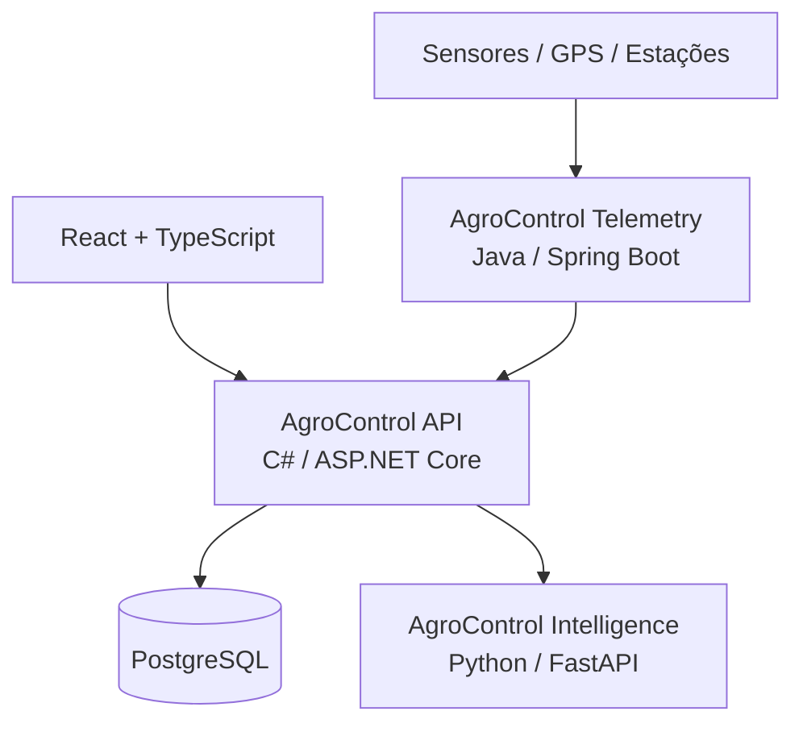

# AgroControl

**AgroControl** é uma plataforma modular para gestão e inteligência no agronegócio. O projeto começa como um **monólito modular em C# / ASP.NET Core**, mantendo pontos claros de integração com serviços especializados em **Python** (dados, IA e visão computacional) e **Java** (telemetria e IoT).

> Status atual: **Sprint 4 concluída — financeiro, fluxo de caixa e rentabilidade por safra**

## Objetivo

Centralizar, em uma única plataforma, os principais fluxos de uma operação rural:

- gestão de propriedades e talhões;
- culturas e safras;
- estoque de insumos;
- custos, receitas e resultado financeiro;
- máquinas e manutenção;
- mercado e commodities;
- agricultura de precisão;
- análise de dados e IA;
- irrigação e sensores;
- sustentabilidade e carbono;
- exportação.

Os módulos podem ser liberados por plano. Recursos indisponíveis continuam visíveis na interface como **bloqueados** ou **em breve**, mas o bloqueio também é validado no backend.

## Stack

| Camada | Tecnologia |
|---|---|
| Frontend | React + TypeScript (planejado) |
| API principal | C# + ASP.NET Core / .NET 10 |
| Banco de dados | PostgreSQL |
| ORM | Entity Framework Core |
| Inteligência / Dados | Python + FastAPI (planejado) |
| Telemetria / IoT | Java + Spring Boot (planejado) |
| Autenticação | JWT |
| Containers | Docker / Docker Compose |
| Orquestração futura | Kubernetes |
| CI/CD | GitHub Actions |
| Observabilidade futura | OpenTelemetry + Grafana |

## Arquitetura



A API principal começa como um **monólito modular**. Python e Java só entram como serviços independentes quando houver uma justificativa técnica real.

## O que já funciona

### Plataforma e segurança

- solução .NET 10 organizada em Domain, Application, Infrastructure e API;
- PostgreSQL com Entity Framework Core e migrations;
- Organization, User e membership usuário-organização;
- papéis `Owner`, `Admin`, `Manager` e `Viewer`;
- cadastro e login com JWT;
- senha protegida com PBKDF2-HMAC-SHA512 e salt aleatório;
- planos `Basic`, `Pro`, `Intelligence` e `Enterprise`;
- entitlements e overrides por organização;
- bloqueio de módulos também no backend;
- Docker Compose com aplicação automática das migrations.

### Produção Rural

- propriedades (`Farm`), talhões (`Field`), culturas (`Crop`) e safras (`Season`);
- CRUD com soft delete, paginação, busca e filtros;
- isolamento por `OrganizationId`;
- validação de área dos talhões;
- produtividade esperada e realizada por hectare.

### Estoque

- categorias, itens com SKU e unidades de medida;
- depósitos vinculáveis a propriedades;
- entradas, saídas e ajustes em ledger append-only;
- saldo por item/depósito e bloqueio de estoque negativo;
- lote, validade e vínculo de consumo com propriedade/talhão/safra;
- alertas de estoque baixo.

### Financeiro

- categorias financeiras e centros de custo;
- despesas e receitas;
- contas pendentes, pagas, recebidas e canceladas;
- datas de competência, vencimento e liquidação;
- separação entre visão por competência e fluxo de caixa;
- vínculo opcional com propriedade, talhão e safra;
- resumo de receitas, despesas, resultado, margem, contas a pagar e a receber;
- resumo econômico por safra com custo por hectare, custo por unidade produzida e ponto de equilíbrio;
- isolamento multi-tenant e proteção pelo módulo `Finance`.

### Qualidade

- testes unitários de domínio e segurança;
- testes de integração com PostgreSQL real;
- CI provisionando PostgreSQL 17 e executando restore, build e test.

## Módulos e planos

### Basic

Identity, Organizations, Farms, Fields, Crops, Seasons, Inventory e Finance.

### Pro

Tudo do Basic + Machinery, Market, Precision Agriculture, Irrigation e Sustainability.

### Intelligence

Tudo do Pro + Intelligence e Telemetry.

### Enterprise

Todos os módulos, incluindo Export.

Documentação detalhada em [`docs/`](docs/), incluindo [`SPRINT_3_INVENTORY.md`](docs/SPRINT_3_INVENTORY.md) e [`SPRINT_4_FINANCE.md`](docs/SPRINT_4_FINANCE.md).

## Executando com Docker

1. Copie `.env.example` para `.env`.
2. Troque `JWT_KEY` e, se desejar, as credenciais locais do PostgreSQL.
3. Execute:

```bash
docker compose up --build
```

A API ficará em `http://localhost:8080`.

## Endpoints atuais

### Plataforma e autenticação

```text
GET  /health
GET  /api/v1/platform/modules
POST /api/v1/auth/register
POST /api/v1/auth/login
GET  /api/v1/me
GET  /api/v1/organizations/current
GET  /api/v1/platform/entitlements
GET  /api/v1/platform/modules/{moduleKey}/access
```

### Produção rural

```text
/api/v1/farms
/api/v1/fields
/api/v1/crops
/api/v1/seasons
```

### Estoque

```text
/api/v1/inventory/categories
/api/v1/inventory/items
/api/v1/inventory/warehouses
/api/v1/inventory/movements
/api/v1/inventory/low-stock
```

### Financeiro

```text
/api/v1/finance/categories
/api/v1/finance/cost-centers
/api/v1/finance/transactions
/api/v1/finance/summary
/api/v1/finance/seasons/{seasonId}/summary
```

Consulte [`docs/SPRINT_4_FINANCE.md`](docs/SPRINT_4_FINANCE.md) para contratos, regras e indicadores.

## Migrations

- `20260907002000_InitialIdentity`
- `20260907010000_ProductionCore`
- `20260907134514_InventoryCore`
- `20260907191652_FinanceCore`

No Docker Compose, as migrations são aplicadas automaticamente porque `Database__ApplyMigrations=true`.

## Segurança

A chave de `appsettings.Development.json` é apenas uma chave conhecida de desenvolvimento local. **Nunca use essa chave em produção.** Em ambientes reais, forneça `Jwt__Key` por secret/variável de ambiente segura.

## Roadmap resumido

1. ✅ **Sprint 0** — fundação, documentação, arquitetura, CI e containers.
2. ✅ **Sprint 1** — identidade, organizações, PostgreSQL e autorização por módulo.
3. ✅ **Sprint 2** — propriedades, talhões, culturas e safras.
4. ✅ **Sprint 3** — estoque e movimentações de insumos.
5. ✅ **Sprint 4** — financeiro e rentabilidade por safra.
6. ⏭️ **Sprint 5** — máquinas e mercado.
7. **Sprint 6** — serviço Python de inteligência.
8. **Sprint 7** — serviço Java de telemetria.
9. **Sprint 8** — observabilidade, CI/CD avançado e Kubernetes.

Detalhes em [`docs/ROADMAP.md`](docs/ROADMAP.md).

## Licença

A licença ainda não foi definida. Não adicione uma licença pública ao projeto sem decidir antes o modelo de distribuição do AgroControl.
