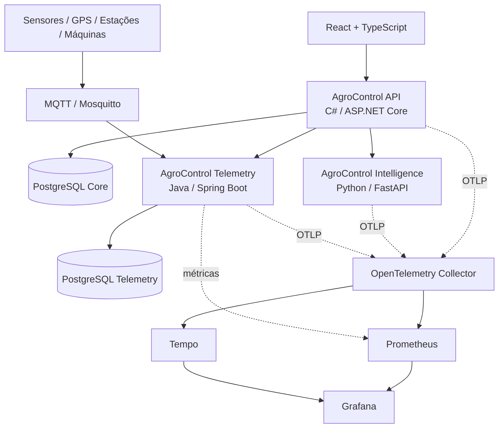

# AgroControl

**AgroControl** é uma plataforma modular para gestão, inteligência e tecnologia no agronegócio. O núcleo operacional é um **monólito modular em C# / ASP.NET Core**; responsabilidades tecnicamente distintas são isoladas em serviços especializados: **Python / FastAPI** para inteligência de dados e **Java / Spring Boot** para telemetria e IoT.

> Status atual: **Sprint 8 concluída — observabilidade, CI/CD, segurança operacional e Kubernetes**

## Objetivo

Centralizar os principais fluxos de uma operação rural em uma única plataforma:

- propriedades, talhões, culturas e safras;
- estoque e movimentações de insumos;
- custos, receitas e rentabilidade;
- máquinas, horímetro, combustível e manutenção;
- commodities e alertas de mercado;
- análise de dados e previsão de produtividade;
- sensores, GPS, estações e telemetria;
- módulos futuros de agricultura de precisão, irrigação, sustentabilidade e exportação.

Os módulos são liberados por plano e o bloqueio é validado no backend, não apenas na interface.

## Stack

| Camada | Tecnologia |
|---|---|
| Frontend | React + TypeScript (planejado) |
| API principal | C# + ASP.NET Core / .NET 10 |
| Banco principal | PostgreSQL + Entity Framework Core |
| Inteligência | Python 3.12 + FastAPI + scikit-learn |
| Telemetria / IoT | Java 21 + Spring Boot |
| Banco de telemetria | PostgreSQL dedicado |
| Mensageria IoT | MQTT + Eclipse Mosquitto |
| Autenticação | JWT |
| Containers | Docker / Docker Compose |
| Observabilidade | OpenTelemetry + Prometheus + Tempo + Grafana |
| CI/CD | GitHub Actions + GHCR |
| Orquestração | Kubernetes + Kustomize |

## Arquitetura



A API principal concentra identidade, assinatura, autorização, `OrganizationId` e regras centrais de negócio. Python cuida de análise/modelagem. Java cuida de ingestão, normalização e histórico de telemetria e **não escreve diretamente no schema do monólito**.

## Funcionalidades implementadas

### Plataforma, identidade e multi-tenancy

- Organization, User e membership usuário-organização;
- papéis `Owner`, `Admin`, `Manager` e `Viewer`;
- cadastro e login com JWT;
- PBKDF2-HMAC-SHA512 com salt aleatório;
- planos `Basic`, `Pro`, `Intelligence` e `Enterprise`;
- entitlements e overrides por organização;
- isolamento por `OrganizationId` e bloqueio de módulos no backend.

### Produção rural

- propriedades (`Farm`), talhões (`Field`), culturas (`Crop`) e safras (`Season`);
- CRUD, soft delete, paginação, busca e filtros;
- validações de área, datas e produtividade;
- produtividade esperada e realizada por hectare.

### Estoque

- categorias, itens, SKU, unidades e depósitos;
- entradas, saídas e ajustes em ledger append-only;
- saldo por item/depósito e bloqueio de estoque negativo;
- lote, validade, consumo por propriedade/talhão/safra e alertas de estoque baixo.

### Financeiro

- categorias e centros de custo;
- despesas, receitas, contas a pagar e receber;
- competência, vencimento e liquidação;
- vínculo com propriedade, talhão e safra;
- resultado, margem, fluxo de caixa, custo/ha, custo por unidade e ponto de equilíbrio.

### Máquinas e mercado

- máquinas, implementos, horímetro, combustível e manutenção;
- manutenção preventiva/corretiva e custos por máquina;
- commodities por organização;
- cotações append-only, variação e alertas por preço-alvo;
- contrato preparado para provedores externos de mercado.

### AgroControl Intelligence

- serviço Python independente com FastAPI;
- contrato HTTP versionado `v1`;
- baseline por produtividade esperada ou média histórica;
- regressão Ridge comparada ao baseline;
- MAE/RMSE quando existe histórico suficiente;
- retorno explícito `insufficient_data` quando não há base confiável;
- cliente HTTP tipado, timeout e tratamento de indisponibilidade;
- isolamento multi-tenant antes da chamada ao serviço.

A previsão é **apoio à decisão** e não substitui avaliação agronômica profissional nem representa garantia de produtividade.

### AgroControl Telemetry

- Java 21 + Spring Boot com PostgreSQL próprio;
- dispositivos por organização e vínculos opcionais com máquina, propriedade e talhão;
- eventos append-only e idempotência por `deviceId + eventId`;
- última leitura e histórico por período/métrica;
- MQTT com QoS 1 e reconexão automática;
- tópico `agrocontrol/v1/devices/{deviceId}/telemetry`;
- validação de timestamp, valor, unidade, coordenadas, metadata e tamanho de payload;
- API interna com credencial serviço-a-serviço;
- endpoints externos protegidos por JWT + entitlement `Telemetry`.

O Mosquitto do repositório é **somente para desenvolvimento**. Produção exige TLS, identidade por dispositivo/gateway, ACLs, rotação de credenciais e operação apropriada do broker.

### DevOps e observabilidade

- OpenTelemetry na API C#, Intelligence Python e Telemetry Java;
- traces distribuídos nas chamadas HTTP instrumentadas;
- logs JSON na API principal;
- liveness e readiness separados;
- readiness da API validando PostgreSQL;
- Spring Boot Actuator + Prometheus no Telemetry;
- OpenTelemetry Collector, Tempo, Prometheus e Grafana em profile opcional;
- dashboard operacional provisionado automaticamente;
- Platform CI com build e smoke test da stack integrada;
- Dependabot e CodeQL para C#, Java/Kotlin e Python;
- publicação de imagens preparada no GHCR por SHA/SemVer com provenance e SBOM;
- Kubernetes com Kustomize, probes, resources, security context e PDB;
- PostgreSQL e MQTT de produção deliberadamente fora dos manifests simplificados.

## Executando localmente

```bash
cp .env.example .env
docker compose up --build
```

Serviços padrão:

```text
AgroControl API          http://localhost:8080
AgroControl Intelligence http://localhost:8090
AgroControl Telemetry    http://localhost:8100
PostgreSQL Core          localhost:5432
PostgreSQL Telemetry     localhost:5433
MQTT / Mosquitto         localhost:1883
```

Para ativar a stack de observabilidade:

```bash
OTEL_ENABLED=true docker compose --profile observability up --build
```

```text
Grafana                   http://localhost:3000
Prometheus                http://localhost:9090
Tempo                     http://localhost:3200
OTLP gRPC                 localhost:4317
OTLP HTTP                 localhost:4318
```

## Health checks

```text
API          GET /health/live
API          GET /health/ready
Intelligence GET /health/live
Intelligence GET /health/ready
Telemetry    GET /actuator/health/liveness
Telemetry    GET /actuator/health/readiness
Telemetry    GET /actuator/prometheus
```

## Endpoints principais

```text
POST /api/v1/auth/register
POST /api/v1/auth/login
GET  /api/v1/me
GET  /api/v1/organizations/current
GET  /api/v1/platform/entitlements

/api/v1/farms
/api/v1/fields
/api/v1/crops
/api/v1/seasons
/api/v1/inventory/*
/api/v1/finance/*
/api/v1/machinery/*
/api/v1/market/*

POST /api/v1/intelligence/seasons/{seasonId}/yield-prediction
/api/v1/telemetry/*
```

Swagger UI do Telemetry:

```text
http://localhost:8100/swagger-ui.html
```

## Kubernetes

A base fica em `k8s/` e pode ser renderizada sem aplicar recursos:

```bash
kubectl kustomize k8s/base
kubectl kustomize k8s/overlays/local
```

Consulte [`k8s/README.md`](k8s/README.md) antes de implantar. Segredos reais não entram no repositório.

## Qualidade e CI/CD

- **Backend CI:** PostgreSQL 17, restore, build e testes .NET;
- **Intelligence CI:** Ruff, pytest, build de imagem e smoke test;
- **Telemetry CI:** Maven, PostgreSQL 17, build de imagem e MQTT ponta a ponta;
- **Platform CI:** Docker Compose completo, observabilidade, Kustomize e smoke tests integrados;
- **CodeQL:** C#, Java/Kotlin e Python;
- **Dependabot:** NuGet, pip, Maven e GitHub Actions.

A Sprint 8 foi integrada após todos os checks do PR #17 concluírem com sucesso.

## Documentação

- [`docs/SPRINT_6_INTELLIGENCE.md`](docs/SPRINT_6_INTELLIGENCE.md)
- [`docs/SPRINT_7_TELEMETRY.md`](docs/SPRINT_7_TELEMETRY.md)
- [`docs/SPRINT_8_PLATFORM_DEVOPS.md`](docs/SPRINT_8_PLATFORM_DEVOPS.md)
- [`docs/ROADMAP.md`](docs/ROADMAP.md)
- [`docs/adr/ADR-005-observability-and-kubernetes.md`](docs/adr/ADR-005-observability-and-kubernetes.md)

## Roadmap resumido

1. ✅ **Sprint 0** — fundação, arquitetura, CI e containers.
2. ✅ **Sprint 1** — identidade, organizações e autorização por módulo.
3. ✅ **Sprint 2** — produção rural.
4. ✅ **Sprint 3** — estoque.
5. ✅ **Sprint 4** — financeiro e rentabilidade.
6. ✅ **Sprint 5** — máquinas e mercado.
7. ✅ **Sprint 6** — Python / Intelligence.
8. ✅ **Sprint 7** — Java / Telemetry / MQTT.
9. ✅ **Sprint 8** — observabilidade, CI/CD, segurança operacional e Kubernetes.

O hardening que depende de ambiente real, política operacional ou testes de carga está separado no issue **#18**.

## Segurança

Defaults presentes no repositório são apenas para desenvolvimento. Em produção, `JWT_KEY`, `TELEMETRY_INTERNAL_API_KEY`, credenciais de banco e credenciais/certificados MQTT devem ser fornecidos por um mecanismo apropriado de secrets management.

## Licença

A licença ainda não foi definida. Não adicione uma licença pública ao projeto sem decidir antes o modelo de distribuição do AgroControl.
