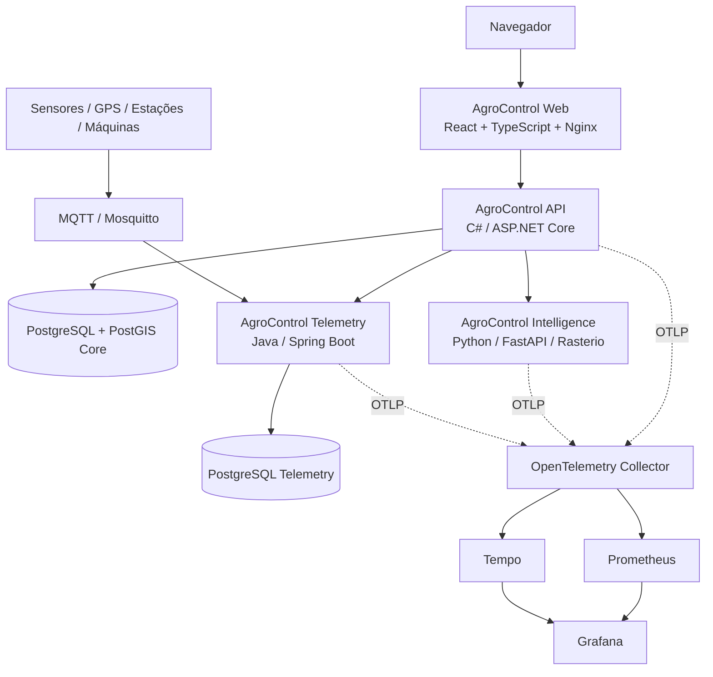

# AgroControl

**AgroControl** é uma plataforma modular de gestão, inteligência e tecnologia para o agronegócio. O núcleo operacional é um **monólito modular em C# / ASP.NET Core**, complementado por **Python / FastAPI** para inteligência e processamento científico, **Java / Spring Boot** para telemetria e uma aplicação web em **React + TypeScript**.

> Status atual: **Sprint 18 concluída — operação multi-fazenda, gestão regional, autorização horizontal e visão consolidada**  
> API: **0.18.0**

## Objetivo

Centralizar os principais fluxos de uma operação rural em uma única plataforma, mantendo:

- isolamento multi-tenant por organização;
- escopo operacional por fazenda/região;
- módulos liberados por plano no backend;
- dados espaciais e operacionais integrados;
- serviços especializados somente quando existe uma fronteira técnica clara.

Hoje o AgroControl cobre:

- propriedades, regiões operacionais, talhões, culturas e safras;
- operação multi-fazenda em diferentes estados e fusos horários;
- acesso `AllFarms`, por região e por fazenda;
- limites geográficos, GeoJSON, PostGIS e zonas de manejo;
- cenas de satélite/drone, footprints e índices vegetativos;
- processamento raster com Rasterio/NumPy e estatísticas zonais;
- estoque e movimentações de insumos;
- custos, receitas, fluxo de caixa e rentabilidade;
- máquinas, horímetro, combustível e manutenção;
- commodities, cotações e alertas de mercado;
- previsão de produtividade e apoio à decisão;
- sensores, GPS, estações e telemetria MQTT;
- irrigação, umidade do solo e aplicações de água;
- sustentabilidade e indicadores gerenciais de CO₂e;
- exportação, câmbio, documentação e logística;
- clientes, contatos, oportunidades e pipeline comercial;
- dashboard e mapa multi-fazenda.

Os módulos são liberados por plano e o bloqueio é validado no backend, não apenas na interface.

## Stack

| Camada | Tecnologia |
|---|---|
| Web | React 19 + TypeScript 7 + Vite 8 |
| API principal | C# + ASP.NET Core / .NET 10 |
| Banco principal | PostgreSQL 17 + PostGIS + Entity Framework Core |
| Inteligência | Python 3.12 + FastAPI + scikit-learn + Rasterio + NumPy |
| Telemetria / IoT | Java 21 + Spring Boot |
| Banco de telemetria | PostgreSQL dedicado |
| Mensageria IoT | MQTT + Eclipse Mosquitto |
| Mapas | MapLibre GL + GeoJSON |
| Autenticação | JWT |
| Containers | Docker / Docker Compose |
| Observabilidade | OpenTelemetry + Prometheus + Tempo + Grafana |
| CI/CD | GitHub Actions + GHCR |
| Orquestração | Kubernetes + Kustomize |

## Arquitetura



A API concentra identidade, assinatura, autorização, `OrganizationId`, escopo operacional por fazenda e regras transacionais. Python é reservado para análise/modelagem e processamento científico. Java é usado para ingestão e histórico de telemetria.

O banco principal não recebe raster pesado de satélite/drone: guarda metadados, referências de assets, lifecycle de processamento e estatísticas derivadas.

## Multi-tenancy e operação multi-fazenda

A Sprint 18 introduziu uma segunda fronteira de autorização dentro da organização:

```text
OrganizationId — fronteira máxima do tenant
      │
      └── FarmAccessScope
              ├── AllFarms
              ├── Region
              └── Farm
```

Uma organização pode operar várias propriedades sem criar tenants separados:

```text
Organization
├── OperationalRegion
│   ├── Farm A
│   │   ├── Field
│   │   └── Season
│   └── Farm B
└── Farm C
```

O papel organizacional (`Owner`, `Admin`, `Manager`, `Viewer`) e o escopo de fazenda são conceitos diferentes. O backend resolve o escopo efetivo por request e protege dados vinculados às propriedades autorizadas.

A proteção horizontal é aplicada em:

- produção rural;
- estoque;
- financeiro;
- máquinas;
- irrigação;
- sustentabilidade;
- exportação;
- comercial;
- agricultura de precisão;
- sensoriamento remoto;
- raster;
- telemetria vinculada a Farm/Field/Machine.

Testes automatizados exercitam acesso **Fazenda A × Fazenda B dentro da mesma organização** para impedir vazamento por listagem, ID direto, contagens ou entidades-filhas.

## AgroControl Web

- registro, login, logout e sessão JWT;
- contexto de organização, papel, plano e entitlements;
- contexto operacional persistido durante a sessão;
- seletor `Todas / Região / UF / Fazenda`;
- app shell responsivo com sidebar/topbar;
- dashboard operacional e executivo multi-fazenda;
- mapa MapLibre com propriedades acessíveis e `fitBounds`;
- CRUD de produção rural;
- Agricultura de Precisão com limites e zonas de manejo;
- workspace de sensoriamento remoto;
- painel de processamento raster;
- irrigação, sustentabilidade, exportação e Comercial/CRM;
- estados de loading, vazio, erro e módulo bloqueado;
- proxy reverso same-origin no Nginx.

O frontend melhora a experiência, mas **não substitui as validações de autorização do backend**.

## Produção rural e localização

- propriedades (`Farm`), regiões (`OperationalRegion`), talhões (`Field`), culturas (`Crop`) e safras (`Season`);
- CRUD, soft delete, filtros e paginação;
- validações de área, datas e produtividade;
- produtividade esperada e realizada por hectare;
- localização estruturada com país, UF, município, CEP e coordenadas opcionais;
- timezone IANA por propriedade.

Eventos técnicos permanecem em UTC. A apresentação operacional usa o timezone da fazenda selecionada. A suíte cobre cenários SP × MT × AM × AC.

## Agricultura de precisão, sensoriamento remoto e raster

- PostGIS no banco principal;
- limites de talhão em WGS84/SRID 4326;
- GeoJSON, validação topológica e índice GiST;
- cálculo geodésico de área;
- zonas `Soil`, `Yield`, `Vegetation`, `Prescription` e `Custom`;
- importação/exportação GeoJSON;
- cenas `Satellite`, `Drone` e `Other`;
- NDVI, NDRE, EVI e índices customizados;
- séries temporais e latest metrics;
- Rasterio + NumPy para GeoTIFF/COG;
- reprojeção, máscara, NoData e estatísticas zonais;
- processamento de talhão e zonas de manejo;
- lifecycle `Pending`, `Processing`, `Succeeded` e `Failed`;
- idempotência por chave de processamento;
- limites MVP de 20 milhões de pixels e 250 geometrias;
- assets remotos desabilitados por padrão.

NDVI, NDRE, EVI, previsões e resultados raster são **apoio à decisão** e não diagnóstico agronômico automático nem garantia de produtividade.

## Estoque e financeiro

- categorias, itens, SKU, depósitos, lotes e validade;
- movimentações append-only e bloqueio de saldo negativo;
- vínculos com propriedade/talhão/safra;
- categorias financeiras e centros de custo;
- despesas, receitas, contas a pagar/receber;
- competência, caixa, resultado, margem, custo/ha, custo/unidade e ponto de equilíbrio;
- consolidação multi-fazenda em BRL sem média indevida de percentuais.

Agregações que não possuem unidade/moeda compatível não são combinadas artificialmente.

## Máquinas e mercado

- máquinas, implementos, horímetro, combustível e manutenção;
- custos por máquina e manutenção preventiva/corretiva;
- commodities, histórico de cotações, variação e alertas de preço;
- contrato preparado para provedores externos de mercado.

## AgroControl Intelligence

- FastAPI independente;
- contrato HTTP versionado `v1`;
- baseline por produtividade esperada/média histórica;
- regressão Ridge;
- MAE/RMSE quando existe histórico suficiente;
- retorno `insufficient_data` quando não há base confiável;
- Rasterio + NumPy para estatísticas zonais;
- cliente HTTP C# com timeout e tratamento de indisponibilidade.

## AgroControl Telemetry

- Java 21 + Spring Boot com PostgreSQL próprio;
- dispositivos por organização e vínculos com máquina/propriedade/talhão;
- eventos append-only e idempotência por `deviceId + eventId`;
- última leitura e histórico por métrica/período;
- MQTT QoS 1 no tópico `agrocontrol/v1/devices/{deviceId}/telemetry`;
- API interna serviço-a-serviço;
- endpoints externos protegidos por JWT + entitlement `Telemetry`;
- fachada C# que aplica o escopo operacional antes do acesso ao serviço Java.

## Irrigação

- zonas de irrigação, método, área e limites de umidade;
- leitura canônica `soil_moisture_percent` no Telemetry;
- classificação hídrica e recomendações de apoio;
- aplicações de água append-only e volume estimado;
- nenhuma atuação automática em bombas, pivôs ou válvulas.

## Sustentabilidade

- fatores de emissão e atividades append-only;
- snapshot de fatores;
- `kgCO2e` e `tCO2e`;
- indicadores por período/propriedade/safra;
- integração desacoplada e idempotente por referência externa.

Os indicadores são estimativas gerenciais. O AgroControl não certifica inventários nem créditos de carbono.

## Exportação e Comercial

- pedidos internacionais, moedas, snapshots de câmbio e Incoterms;
- timeline, logística, custos e checklist documental;
- clientes, contatos e oportunidades;
- pipeline comercial, probabilidade e resumo separado por moeda;
- normalização de vínculos Farm/Season/ExportOrder para manter o escopo horizontal.

Esses módulos são gerenciais e não substituem emissão fiscal, Siscomex, despacho aduaneiro, contrato ou contabilidade oficial.

## Planos e módulos

O catálogo canônico de acesso está no backend em `PlanEntitlementCatalog`.

Resumo:

- **Basic:** identidade, organização, produção, estoque e financeiro;
- **Pro:** Basic + máquinas, mercado, agricultura de precisão, irrigação, sustentabilidade e comercial;
- **Intelligence:** Pro + Intelligence e Telemetry;
- **Enterprise:** todos os módulos, incluindo Export.

Overrides por organização podem habilitar/desabilitar módulos individualmente.

Veja [`docs/MODULES.md`](docs/MODULES.md).

## Executando localmente

```bash
cp .env.example .env
docker compose up --build
```

Serviços padrão:

```text
AgroControl Web          http://localhost:3001
AgroControl API          http://localhost:8080
AgroControl Intelligence http://localhost:8090
AgroControl Telemetry    http://localhost:8100
PostgreSQL + PostGIS     localhost:5432
PostgreSQL Telemetry     localhost:5433
MQTT / Mosquitto         localhost:1883
```

Observabilidade opcional:

```bash
OTEL_ENABLED=true docker compose --profile observability up --build
```

## Health checks

```text
API          GET /health/live
API          GET /health/ready
Intelligence GET /health/live
Intelligence GET /health/ready
Telemetry    GET /actuator/health/liveness
Telemetry    GET /actuator/health/readiness
Telemetry    GET /actuator/prometheus
Web          GET /
```

## Endpoints principais

```text
POST /api/v1/auth/register
POST /api/v1/auth/login
GET  /api/v1/me
GET  /api/v1/organizations/current
GET  /api/v1/platform/entitlements

/api/v1/farms
/api/v1/fields
/api/v1/crops
/api/v1/seasons

GET    /api/v1/operations/regions
POST   /api/v1/operations/regions
GET    /api/v1/operations/farm-access/me
GET    /api/v1/operations/farm-access/users/{userId}
POST   /api/v1/operations/farm-access
DELETE /api/v1/operations/farm-access/{assignmentId}

/api/v1/precision/*
/api/v1/precision/remote-sensing/*
POST /api/v1/precision/remote-sensing/scenes/{sceneId}/process
GET  /api/v1/precision/remote-sensing/scenes/{sceneId}/processings
GET  /api/v1/precision/remote-sensing/processing-results

/api/v1/irrigation/*
/api/v1/sustainability/*
/api/v1/export/*
/api/v1/commercial/*
/api/v1/inventory/*
/api/v1/finance/*
/api/v1/machinery/*
/api/v1/market/*
POST /api/v1/intelligence/seasons/{seasonId}/yield-prediction
/api/v1/telemetry/*
```

## Kubernetes

```bash
kubectl kustomize k8s/base
kubectl kustomize k8s/overlays/local
```

Segredos reais não entram no repositório.

## Qualidade e CI/CD

- **Backend CI:** PostgreSQL 17 + PostGIS, restore, build e testes .NET;
- **Intelligence CI:** Ruff, pytest, imagem e smoke test;
- **Telemetry CI:** Maven, PostgreSQL 17, imagem e MQTT ponta a ponta;
- **Frontend CI:** `npm ci`, type-check, Vitest, build, imagem e smoke test;
- **Platform CI:** Docker Compose completo, web, PostGIS, observabilidade, Kustomize e smoke tests integrados;
- **CodeQL:** C#, Java/Kotlin, Python e JavaScript/TypeScript;
- **Dependabot:** NuGet, pip, Maven, npm e GitHub Actions.

A Sprint 18 foi mesclada somente depois de **Backend CI + Frontend CI + Platform CI + CodeQL** ficarem verdes no mesmo head do PR #51.

## Documentação

- [`docs/ARCHITECTURE.md`](docs/ARCHITECTURE.md)
- [`docs/DOMAIN.md`](docs/DOMAIN.md)
- [`docs/MODULES.md`](docs/MODULES.md)
- [`docs/ROADMAP.md`](docs/ROADMAP.md)
- [`docs/SPRINT_6_INTELLIGENCE.md`](docs/SPRINT_6_INTELLIGENCE.md)
- [`docs/SPRINT_7_TELEMETRY.md`](docs/SPRINT_7_TELEMETRY.md)
- [`docs/SPRINT_8_PLATFORM_DEVOPS.md`](docs/SPRINT_8_PLATFORM_DEVOPS.md)
- [`docs/SPRINT_9_WEB.md`](docs/SPRINT_9_WEB.md)
- [`docs/SPRINT_10_PRECISION_AGRICULTURE.md`](docs/SPRINT_10_PRECISION_AGRICULTURE.md)
- [`docs/SPRINT_11_IRRIGATION.md`](docs/SPRINT_11_IRRIGATION.md)
- [`docs/SPRINT_12_SUSTAINABILITY.md`](docs/SPRINT_12_SUSTAINABILITY.md)
- [`docs/SPRINT_13_EXPORT.md`](docs/SPRINT_13_EXPORT.md)
- [`docs/SPRINT_14_COMMERCIAL.md`](docs/SPRINT_14_COMMERCIAL.md)
- [`docs/SPRINT_15_GEOSPATIAL_ZONES.md`](docs/SPRINT_15_GEOSPATIAL_ZONES.md)
- [`docs/SPRINT_16_REMOTE_SENSING.md`](docs/SPRINT_16_REMOTE_SENSING.md)
- [`docs/SPRINT_17_RASTER_PROCESSING.md`](docs/SPRINT_17_RASTER_PROCESSING.md)
- [`docs/SPRINT_18_MULTI_FARM.md`](docs/SPRINT_18_MULTI_FARM.md)

## Roadmap resumido

1. ✅ Sprint 0 — fundação, arquitetura, CI e containers.
2. ✅ Sprint 1 — identidade, organizações e autorização por módulo.
3. ✅ Sprint 2 — produção rural.
4. ✅ Sprint 3 — estoque.
5. ✅ Sprint 4 — financeiro e rentabilidade.
6. ✅ Sprint 5 — máquinas e mercado.
7. ✅ Sprint 6 — Python / Intelligence.
8. ✅ Sprint 7 — Java / Telemetry / MQTT.
9. ✅ Sprint 8 — observabilidade, CI/CD e Kubernetes.
10. ✅ Sprint 9 — AgroControl Web.
11. ✅ Sprint 10 — PostGIS, GeoJSON e talhões georreferenciados.
12. ✅ Sprint 11 — irrigação e manejo hídrico.
13. ✅ Sprint 12 — sustentabilidade e CO₂e.
14. ✅ Sprint 13 — exportação e logística internacional.
15. ✅ Sprint 14 — Comercial/CRM.
16. ✅ Sprint 15 — importação GeoJSON e zonas de manejo.
17. ✅ Sprint 16 — sensoriamento remoto e índices vegetativos.
18. ✅ Sprint 17 — processamento raster e estatísticas zonais.
19. ✅ Sprint 18 — operação multi-fazenda, gestão regional e autorização horizontal.

O hardening dependente de ambiente real, política operacional ou testes de carga permanece separado no issue **#18**.

## Segurança

Defaults do repositório são apenas de desenvolvimento. Em produção, `JWT_KEY`, `TELEMETRY_INTERNAL_API_KEY`, credenciais de banco e credenciais/certificados MQTT devem vir de secrets management apropriado.

O mapa usa URLs configuráveis. Credenciais de provedores de tiles/imagens não devem ser tratadas como segredo confiável quando expostas ao navegador.

Assets raster remotos permanecem desabilitados por padrão. Quando habilitados, devem ser combinados em produção com allowlists, egress control e credenciais gerenciadas; referências remotas não devem transportar credenciais na URL.

O JWT do frontend usa `sessionStorage` por compatibilidade com o contrato bearer atual. Uma evolução para BFF/cookie HttpOnly pode ser adotada quando o modelo de exposição pública justificar esse endurecimento.

## Licença

A licença ainda não foi definida. Não adicione licença pública ao projeto sem decidir antes o modelo de distribuição do AgroControl.