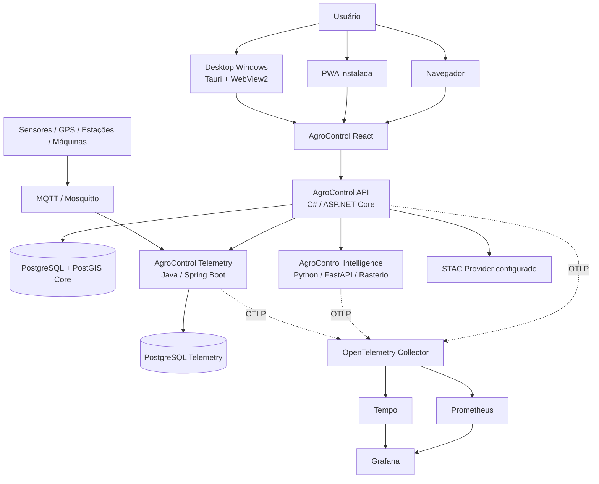

# AgroControl

**AgroControl** é uma plataforma modular de gestão, inteligência e tecnologia para o agronegócio. O núcleo transacional é um **monólito modular em C# / ASP.NET Core**, complementado por **Python / FastAPI** para inteligência e processamento científico, **Java / Spring Boot** para telemetria e uma única aplicação **React + TypeScript + Vite** distribuída em navegador, PWA e Desktop Windows.

> Status: **Sprint 20 — Web instalável + Desktop Tauri em validação final**  
> API: **0.19.0**  
> Desktop: **0.20.0**

## Objetivo

Centralizar os principais fluxos de uma operação rural em uma plataforma única, preservando:

- isolamento multi-tenant por organização;
- escopo operacional por fazenda e região;
- módulos liberados por plano no backend;
- dados geoespaciais e operacionais integrados;
- serviços especializados somente quando existe fronteira técnica clara;
- uma única base de interface para Web, PWA e Desktop;
- segurança e autorização sempre server-side.

## Superfícies do produto

```text
                    AgroControl React / TypeScript / Vite
                                  │
                 ┌────────────────┼────────────────┐
                 │                │                │
                 ▼                ▼                ▼
             Navegador           PWA          Tauri Desktop
                 │                │                │
                 └────────────────┴────────────────┘
                                  │ HTTPS
                                  ▼
                           AgroControl API
                                  │
              ┌───────────────────┼───────────────────┐
              ▼                   ▼                   ▼
      PostgreSQL/PostGIS     Intelligence        Telemetry
                              Python              Java/MQTT
```

A interface React é canônica. Não existe fork de telas, contratos ou regras de autorização para Desktop.

### Navegador

- aplicação React servida por Nginx;
- proxy same-origin para `/api` e `/health`;
- sessão JWT;
- funcionamento completo enquanto a API está disponível.

### PWA

- manifest instalável;
- ícone vetorial próprio;
- `display: standalone`;
- service worker para app shell e assets estáticos;
- indicador explícito de perda de conexão;
- atualização controlada do shell.

O service worker **não cacheia dados de negócio autenticados** e exclui `/api` e `/health` da estratégia offline.

### Desktop Windows

- Tauri v2 + WebView2;
- mesma SPA React/Vite;
- bundles NSIS `.exe` e MSI `.msi`;
- nenhum backend C#, PostgreSQL, Python ou Java embutido;
- sem comandos Rust privilegiados nesta fase;
- `withGlobalTauri=false`;
- capabilities vazias;
- DevTools desabilitadas na distribuição;
- CSP explícita;
- CORS por allowlist na API;
- service worker PWA desabilitado dentro do Tauri.

Os instaladores produzidos pelo CI são **artefatos de validação não assinados**. Distribuição pública oficial depende de URL HTTPS real da API, CSP final e certificado de assinatura de código.

## Stack

| Camada | Tecnologia |
|---|---|
| Interface | React 19 + TypeScript 7 + Vite 8 |
| PWA | Web App Manifest + Service Worker |
| Desktop | Tauri v2 + Rust + WebView2 |
| API principal | C# + ASP.NET Core / .NET 10 |
| Banco principal | PostgreSQL 17 + PostGIS + Entity Framework Core |
| Inteligência | Python 3.12 + FastAPI + scikit-learn + Rasterio + NumPy |
| Telemetria / IoT | Java 21 + Spring Boot |
| Banco de telemetria | PostgreSQL dedicado |
| Mensageria IoT | MQTT + Eclipse Mosquitto |
| Mapas | MapLibre GL + GeoJSON |
| Catálogo geoespacial | STAC API / STAC Items |
| Autenticação | JWT |
| Containers | Docker / Docker Compose |
| Observabilidade | OpenTelemetry + Prometheus + Tempo + Grafana |
| CI/CD | GitHub Actions + GHCR |
| Orquestração | Kubernetes + Kustomize |

## Arquitetura



A API concentra identidade, assinatura, autorização, `OrganizationId`, `FarmAccessScope`, entitlements e regras transacionais. Python é reservado para modelagem/processamento científico. Java é reservado para ingestão e histórico de telemetria.

## Cobertura funcional

O AgroControl já possui base funcional para:

- propriedades, regiões operacionais, talhões, culturas e safras;
- operação multi-fazenda em diferentes estados e fusos horários;
- acesso `AllFarms`, por região e por fazenda;
- limites geográficos, GeoJSON, PostGIS e zonas de manejo;
- cenas de satélite/drone, footprints e índices vegetativos;
- descoberta STAC e importação controlada de cenas;
- processamento raster com Rasterio/NumPy e estatísticas zonais;
- estoque e movimentações de insumos;
- custos, receitas, fluxo de caixa e rentabilidade;
- máquinas, horímetro, combustível e manutenção;
- commodities, cotações e alertas de mercado;
- previsão de produtividade e apoio à decisão;
- sensores, GPS, estações e telemetria MQTT;
- irrigação e manejo hídrico;
- sustentabilidade e indicadores de CO₂e;
- exportação e logística internacional;
- clientes, contatos, oportunidades e pipeline comercial;
- dashboard e mapa multi-fazenda;
- instalação como PWA;
- distribuição Desktop Windows via Tauri.

## Multi-tenancy e operação multi-fazenda

```text
OrganizationId — fronteira máxima do tenant
      │
      └── FarmAccessScope
              ├── AllFarms
              ├── Region
              └── Farm
```

Uma organização pode operar várias propriedades sem criar tenants separados:

```text
Organization
├── OperationalRegion
│   ├── Farm A
│   │   ├── Field
│   │   └── Season
│   └── Farm B
└── Farm C
```

O papel organizacional (`Owner`, `Admin`, `Manager`, `Viewer`) e o escopo de fazenda são conceitos distintos. O backend resolve o escopo efetivo por request.

A proteção horizontal é aplicada em produção, estoque, financeiro, máquinas, irrigação, sustentabilidade, exportação, comercial, agricultura de precisão, sensoriamento remoto, raster e telemetria vinculada a Farm/Field/Machine.

Testes automatizados exercitam **Fazenda A × Fazenda B dentro da mesma organização** para impedir acesso por listagem, ID direto, contagens ou entidades-filhas fora do escopo.

## Planos e módulos

O catálogo canônico está no backend em `PlanEntitlementCatalog`.

- **Basic:** identidade, organização, produção, estoque e financeiro;
- **Pro:** Basic + máquinas, mercado, agricultura de precisão, irrigação, sustentabilidade e comercial;
- **Intelligence:** Pro + Intelligence e Telemetry;
- **Enterprise:** todos os módulos, incluindo Export.

Overrides por organização podem habilitar ou desabilitar módulos individualmente. O frontend pode apresentar um módulo bloqueado, mas a autorização real permanece na API.

Veja [`docs/MODULES.md`](docs/MODULES.md).

## Agricultura de precisão e sensoriamento remoto

- PostGIS no banco principal;
- limites de talhão WGS84/SRID 4326;
- GeoJSON e validação topológica;
- índice espacial GiST;
- cálculo geodésico de área;
- zonas `Soil`, `Yield`, `Vegetation`, `Prescription` e `Custom`;
- cenas `Satellite`, `Drone` e `Other`;
- NDVI, NDRE, EVI e índices customizados;
- séries temporais e latest metrics;
- MapLibre na interface.

### Descoberta STAC

- providers configurados server-side;
- busca pelo boundary canônico do Field;
- filtros de período, coleção, nuvens e provider;
- paginação protegida;
- normalização de metadata e assets;
- importação explícita;
- reconsulta server-side do item antes da importação;
- seleção por `AssetKey`, sem confiar em URL enviada pelo cliente;
- idempotência por `Provider + ExternalId`;
- proteção por `OrganizationId + FarmAccessScope`.

A descoberta não baixa nem processa raster automaticamente. Importação e processamento são etapas distintas.

### Raster

- Rasterio + NumPy;
- GeoTIFF/COG;
- reprojeção de CRS;
- máscara e NoData;
- estatísticas zonais;
- processamento por talhão e zona de manejo;
- lifecycle `Pending`, `Processing`, `Succeeded`, `Failed`;
- idempotência por chave de processamento.

NDVI, previsões e resultados raster são **apoio à decisão** e não diagnóstico agronômico automático.

## Intelligence

- FastAPI independente;
- contrato HTTP versionado `v1`;
- baseline e regressão Ridge;
- MAE/RMSE;
- `insufficient_data` quando não existe histórico confiável;
- Rasterio/NumPy para processamento científico;
- cliente HTTP C# com timeout e tratamento de indisponibilidade.

## Telemetry

- Java 21 + Spring Boot;
- PostgreSQL próprio;
- dispositivos por organização;
- vínculos com Farm/Field/Machine;
- eventos append-only;
- idempotência por `deviceId + eventId`;
- última leitura e histórico;
- MQTT QoS 1;
- fachada C# aplicando escopo operacional antes do acesso ao serviço Java.

## Execução local da plataforma

Na raiz do repositório:

```bash
cp .env.example .env
docker compose up --build
```

Serviços padrão:

```text
AgroControl Web          http://localhost:3001
AgroControl API          http://localhost:8080
AgroControl Intelligence http://localhost:8090
AgroControl Telemetry    http://localhost:8100
PostgreSQL + PostGIS     localhost:5432
PostgreSQL Telemetry     localhost:5433
MQTT / Mosquitto         localhost:1883
```

Observabilidade opcional:

```bash
OTEL_ENABLED=true docker compose --profile observability up --build
```

## Desenvolvimento da Web

```bash
cd src/frontend
npm ci
npm run dev
```

Build de produção:

```bash
npm run build
```

## PWA

A PWA usa o mesmo build da Web. O manifest e o service worker são copiados para `dist/` durante o build do Vite.

A fonte canônica dos ícones é:

```text
src/frontend/public/icons/agrocontrol.svg
```

A PWA instala o shell da aplicação, mas **não transforma dados autenticados em cache offline**.

## Desktop Windows

Pré-requisitos de desenvolvimento:

- Node.js compatível com o projeto;
- Rust stable;
- toolchain Windows necessária ao Tauri/WebView2.

No diretório `src/frontend`:

```bash
npm ci
npm run desktop:dev
```

Para gerar os instaladores:

```bash
npm run desktop:build
```

Antes do build, `desktop:icons` usa o Tauri CLI para gerar os ícones nativos a partir de `public/icons/agrocontrol.svg`.

Em CI, o Windows build gera:

```text
NSIS  .exe
MSI   .msi
```

Esses artefatos permanecem não assinados enquanto não existir certificado real de code signing.

### API no Desktop

O Desktop usa `VITE_API_BASE_URL` no momento do build. O CI utiliza `http://localhost:8080` somente para validação.

Um release público deve usar uma URL HTTPS real e adicionar **essa origem específica** à CSP. Não é usado wildcard `https:` para liberar qualquer endpoint.

No Windows, a origem de produção do shell Tauri é permitida por CORS explícito na API. CORS não substitui autenticação: JWT, tenant, entitlement e `FarmAccessScope` continuam sendo validados pelo backend.

## Offline: limite atual

A Sprint 20 entrega **instalação**, não sincronização offline de dados de negócio.

Atualmente:

- o shell PWA pode ser aberto sem rede;
- assets estáticos podem ser servidos do cache;
- `/api` e `/health` nunca são cacheados pelo service worker;
- Desktop não adiciona banco local;
- não existe fila local de alterações;
- não existe merge automático de conflitos;
- raster/mapas operacionais não são baixados automaticamente para uso offline.

Offline real será tratado em uma sprint própria com armazenamento local, outbox, idempotência, versionamento, autorização na sincronização e resolução explícita de conflitos.

## Segurança

Princípios atuais:

- JWT e autorização no backend;
- isolamento por `OrganizationId`;
- restrição horizontal por `FarmAccessScope`;
- entitlement validado na API;
- frontend nunca é fronteira de autorização;
- secrets fora do repositório;
- CORS por allowlist;
- CSP explícita no Tauri;
- `withGlobalTauri=false`;
- capabilities Tauri vazias na fase inicial;
- nenhum comando Rust privilegiado exposto;
- service worker sem cache de dados autenticados;
- JWT continua em `sessionStorage`, sem persistência nativa adicional;
- CodeQL e Dependabot;
- STAC providers definidos server-side;
- assets raster remotos desabilitados por padrão no Intelligence;
- instalador oficial condicionado a code signing real.

Uma evolução para BFF/cookie HttpOnly pode ser adotada quando o modelo de exposição pública justificar esse endurecimento.

## Health checks

```text
API          GET /health/live
API          GET /health/ready
Intelligence GET /health/live
Intelligence GET /health/ready
Telemetry    GET /actuator/health/liveness
Telemetry    GET /actuator/health/readiness
Telemetry    GET /actuator/prometheus
Web          GET /
```

## Kubernetes

```bash
kubectl kustomize k8s/base
kubectl kustomize k8s/overlays/local
```

Segredos reais não entram no repositório.

## Qualidade e CI/CD

- **Backend CI:** PostgreSQL/PostGIS, restore, build e testes .NET;
- **Intelligence CI:** Ruff, pytest, imagem e smoke test;
- **Telemetry CI:** Maven, PostgreSQL, imagem e MQTT ponta a ponta;
- **Frontend CI:** npm, TypeScript, Vitest, PWA artifacts, build, container e smoke test;
- **Desktop CI:** geração de ícones Tauri + build Windows NSIS/MSI;
- **Platform CI:** stack integrada, PostGIS, observabilidade, Kustomize e smoke tests;
- **CodeQL:** C#, Java/Kotlin, Python e JavaScript/TypeScript;
- **Dependabot:** NuGet, pip, Maven, npm e GitHub Actions.

A Sprint 20 só é encerrada com **Frontend CI + Desktop CI + Backend CI + Platform CI + CodeQL** verdes no mesmo head final.

## Documentação

- [`docs/ARCHITECTURE.md`](docs/ARCHITECTURE.md)
- [`docs/DOMAIN.md`](docs/DOMAIN.md)
- [`docs/MODULES.md`](docs/MODULES.md)
- [`docs/ROADMAP.md`](docs/ROADMAP.md)
- [`docs/SPRINT_6_INTELLIGENCE.md`](docs/SPRINT_6_INTELLIGENCE.md)
- [`docs/SPRINT_7_TELEMETRY.md`](docs/SPRINT_7_TELEMETRY.md)
- [`docs/SPRINT_8_PLATFORM_DEVOPS.md`](docs/SPRINT_8_PLATFORM_DEVOPS.md)
- [`docs/SPRINT_9_WEB.md`](docs/SPRINT_9_WEB.md)
- [`docs/SPRINT_10_PRECISION_AGRICULTURE.md`](docs/SPRINT_10_PRECISION_AGRICULTURE.md)
- [`docs/SPRINT_11_IRRIGATION.md`](docs/SPRINT_11_IRRIGATION.md)
- [`docs/SPRINT_12_SUSTAINABILITY.md`](docs/SPRINT_12_SUSTAINABILITY.md)
- [`docs/SPRINT_13_EXPORT.md`](docs/SPRINT_13_EXPORT.md)
- [`docs/SPRINT_14_COMMERCIAL.md`](docs/SPRINT_14_COMMERCIAL.md)
- [`docs/SPRINT_15_GEOSPATIAL_ZONES.md`](docs/SPRINT_15_GEOSPATIAL_ZONES.md)
- [`docs/SPRINT_16_REMOTE_SENSING.md`](docs/SPRINT_16_REMOTE_SENSING.md)
- [`docs/SPRINT_17_RASTER_PROCESSING.md`](docs/SPRINT_17_RASTER_PROCESSING.md)
- [`docs/SPRINT_18_MULTI_FARM.md`](docs/SPRINT_18_MULTI_FARM.md)
- [`docs/SPRINT_19_STAC_DISCOVERY.md`](docs/SPRINT_19_STAC_DISCOVERY.md)
- [`docs/SPRINT_20_INSTALLABLE_APP.md`](docs/SPRINT_20_INSTALLABLE_APP.md)

## Roadmap resumido

1. ✅ Sprint 0 — fundação, arquitetura, CI e containers.
2. ✅ Sprint 1 — identidade, organizações e autorização por módulo.
3. ✅ Sprint 2 — produção rural.
4. ✅ Sprint 3 — estoque.
5. ✅ Sprint 4 — financeiro e rentabilidade.
6. ✅ Sprint 5 — máquinas e mercado.
7. ✅ Sprint 6 — Python / Intelligence.
8. ✅ Sprint 7 — Java / Telemetry / MQTT.
9. ✅ Sprint 8 — observabilidade, CI/CD e Kubernetes.
10. ✅ Sprint 9 — AgroControl Web.
11. ✅ Sprint 10 — PostGIS, GeoJSON e talhões georreferenciados.
12. ✅ Sprint 11 — irrigação e manejo hídrico.
13. ✅ Sprint 12 — sustentabilidade e CO₂e.
14. ✅ Sprint 13 — exportação e logística internacional.
15. ✅ Sprint 14 — Comercial/CRM.
16. ✅ Sprint 15 — importação GeoJSON e zonas de manejo.
17. ✅ Sprint 16 — sensoriamento remoto e índices vegetativos.
18. ✅ Sprint 17 — processamento raster e estatísticas zonais.
19. ✅ Sprint 18 — operação multi-fazenda e autorização horizontal.
20. ✅ Sprint 19 — STAC, descoberta de cenas e importação controlada.
21. 🚧 Sprint 20 — PWA + Desktop Windows Tauri, em validação final.

O hardening dependente de ambiente real, política operacional ou testes de carga permanece separado no issue **#18**.

## Licença

A licença ainda não foi definida. Não adicione licença pública ao projeto sem decidir antes o modelo de distribuição do AgroControl.
