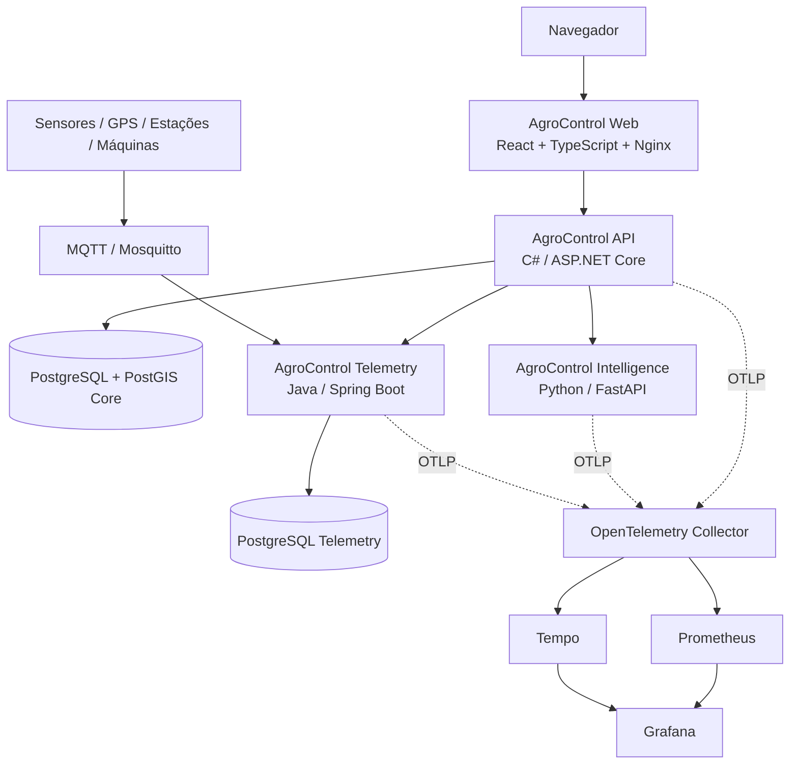

# AgroControl

**AgroControl** é uma plataforma modular de gestão, inteligência e tecnologia para o agronegócio. O núcleo operacional é um **monólito modular em C# / ASP.NET Core**, complementado por **Python / FastAPI** para inteligência, **Java / Spring Boot** para telemetria e uma aplicação web em **React + TypeScript**.

> Status atual: **Sprint 16 concluída — sensoriamento remoto, cenas de satélite/drone e índices NDVI/NDRE/EVI**

## Objetivo

Centralizar os principais fluxos de uma operação rural em uma única plataforma, mantendo isolamento multi-tenant e liberando funcionalidades por plano no backend.

Hoje o AgroControl cobre:

- propriedades, talhões, culturas e safras;
- limites geográficos, GeoJSON, PostGIS e zonas de manejo;
- cenas de satélite/drone, footprints e índices vegetativos;
- estoque e movimentações de insumos;
- custos, receitas e rentabilidade;
- máquinas, horímetro, combustível e manutenção;
- commodities, cotações e alertas de mercado;
- previsão de produtividade e apoio à decisão;
- sensores, GPS, estações e telemetria MQTT;
- irrigação, umidade do solo e aplicações de água;
- sustentabilidade e indicadores gerenciais de CO₂e;
- exportação, câmbio, documentação e logística;
- clientes, contatos, oportunidades e pipeline comercial.

Os módulos são liberados por plano e o bloqueio é validado no backend, não apenas na interface.

## Stack

| Camada | Tecnologia |
|---|---|
| Web | React 19 + TypeScript 7 + Vite 8 |
| API principal | C# + ASP.NET Core / .NET 10 |
| Banco principal | PostgreSQL 17 + PostGIS + Entity Framework Core |
| Inteligência | Python 3.12 + FastAPI + scikit-learn |
| Telemetria / IoT | Java 21 + Spring Boot |
| Banco de telemetria | PostgreSQL dedicado |
| Mensageria IoT | MQTT + Eclipse Mosquitto |
| Mapas | MapLibre GL + GeoJSON |
| Autenticação | JWT |
| Containers | Docker / Docker Compose |
| Observabilidade | OpenTelemetry + Prometheus + Tempo + Grafana |
| CI/CD | GitHub Actions + GHCR |
| Orquestração | Kubernetes + Kustomize |

## Arquitetura



A API concentra identidade, assinatura, autorização, `OrganizationId` e regras transacionais. Python é reservado para análise/modelagem e para evoluções de processamento científico. Java é usado para ingestão e histórico de telemetria. O banco principal não recebe raster pesado de satélite/drone: guarda metadados, footprints, referências de assets e estatísticas processadas.

## Funcionalidades implementadas

### AgroControl Web

- registro, login, logout e sessão JWT;
- contexto de organização, papel, plano e entitlements;
- app shell responsivo com sidebar/topbar;
- dashboard operacional;
- CRUD de produção rural;
- Agricultura de Precisão com MapLibre, limites e zonas de manejo;
- workspace de sensoriamento remoto com cenas, filtros, linha do tempo, footprints, latest metrics e gráficos temporais;
- irrigação, sustentabilidade, exportação e Comercial/CRM;
- estados de loading, vazio, erro e módulo bloqueado;
- proxy reverso same-origin no Nginx.

O frontend melhora a experiência, mas **não substitui as validações de autorização do backend**.

### Plataforma, identidade e multi-tenancy

- `Organization`, `User` e membership usuário-organização;
- papéis `Owner`, `Admin`, `Manager` e `Viewer`;
- JWT e hash PBKDF2-HMAC-SHA512 com salt aleatório;
- planos `Basic`, `Pro`, `Intelligence` e `Enterprise`;
- entitlements e overrides por organização;
- isolamento por `OrganizationId` em repositórios e queries.

### Produção rural

- propriedades (`Farm`), talhões (`Field`), culturas (`Crop`) e safras (`Season`);
- CRUD, soft delete, filtros e paginação;
- validações de área, datas e produtividade;
- produtividade esperada e realizada por hectare.

### Agricultura de precisão e geoespacial

- PostGIS no banco principal;
- limite opcional do talhão como `geography(Polygon,4326)`;
- GeoJSON WGS84, validação topológica e índice GiST;
- cálculo geodésico de área;
- comparação entre área espacial e cadastral sem alteração silenciosa;
- zonas `Soil`, `Yield`, `Vegetation`, `Prescription` e `Custom`;
- importação de `Feature`/`FeatureCollection` com limite de 250 features;
- importação em lote transacional;
- contenção de zona no talhão com tolerância técnica documentada de 0,5 m;
- exportação `FeatureCollection`;
- camadas MapLibre com pré-visualização e controle de visibilidade.

### Sensoriamento remoto

- cenas `Satellite`, `Drone` e `Other`;
- Field obrigatório e Season opcional, sempre no mesmo tenant;
- provedor e identificador externo com unicidade `(OrganizationId, Provider, ExternalId)`;
- aquisição UTC, cobertura de nuvens, resolução espacial, referência externa do asset e observações;
- footprint opcional `geography(Polygon,4326)` com índice GiST;
- desativação lógica de cenas para preservar histórico;
- observações append-only de `NDVI`, `NDRE`, `EVI` e `Custom`;
- mínimo, máximo, média, mediana, desvio-padrão, cobertura válida e amostras/pixels;
- vínculo opcional com zona de manejo do mesmo talhão;
- snapshot de fonte e data da cena em cada observação;
- séries temporais por talhão, safra, zona e índice;
- resumo com índice mais recente e contagem de cenas;
- rota web `/precision/remote-sensing` com cards, timeline, gráfico temporal e mapa do footprint.

NDVI, NDRE e EVI são **indicadores de sensoriamento remoto para apoio à decisão**. O AgroControl não os transforma automaticamente em diagnóstico de doença, praga, deficiência nutricional, estresse hídrico ou produtividade.

O raster pesado permanece fora do PostgreSQL principal. A evolução para processamento de bandas, máscaras e estatística zonal deve usar uma camada especializada, preferencialmente o AgroControl Intelligence/Python.

### Estoque e financeiro

- categorias, itens, SKU, depósitos, lotes e validade;
- movimentações append-only e bloqueio de saldo negativo;
- consumo relacionado a propriedade/talhão/safra;
- categorias financeiras e centros de custo;
- despesas, receitas, contas a pagar/receber;
- competência, caixa, resultado, margem, custo/ha, custo/unidade e ponto de equilíbrio.

### Máquinas e mercado

- máquinas, implementos, horímetro, combustível e manutenção;
- custos por máquina e manutenção preventiva/corretiva;
- commodities, histórico de cotações, variação e alertas de preço;
- contrato preparado para provedores externos de mercado.

### AgroControl Intelligence

- FastAPI independente;
- contrato HTTP versionado `v1`;
- baseline por produtividade esperada/média histórica;
- regressão Ridge;
- MAE/RMSE quando existe histórico suficiente;
- retorno `insufficient_data` quando não há base confiável;
- cliente HTTP C# com timeout e isolamento multi-tenant.

A previsão é apoio à decisão e não garantia de produtividade.

### AgroControl Telemetry

- Java 21 + Spring Boot com PostgreSQL próprio;
- dispositivos por organização e vínculos com máquina/propriedade/talhão;
- eventos append-only e idempotência por `deviceId + eventId`;
- última leitura e histórico por métrica/período;
- MQTT QoS 1 no tópico `agrocontrol/v1/devices/{deviceId}/telemetry`;
- API interna serviço-a-serviço;
- endpoints externos protegidos por JWT + entitlement `Telemetry`.

### Irrigação

- zonas de irrigação, método, área e limites de umidade;
- leitura canônica `soil_moisture_percent` no Telemetry;
- classificação hídrica e recomendações de apoio;
- aplicações de água append-only e volume estimado;
- nenhuma atuação automática em bombas, pivôs ou válvulas.

### Sustentabilidade

- fatores de emissão e atividades append-only;
- snapshot de fatores;
- `kgCO2e` e `tCO2e`;
- indicadores por período/propriedade/safra;
- integração desacoplada e idempotente por referência externa.

Os indicadores são estimativas gerenciais. O AgroControl não certifica inventários nem créditos de carbono.

### Exportação e Comercial

- pedidos internacionais, moedas, snapshots de câmbio e Incoterms;
- timeline, logística, custos e checklist documental;
- clientes, contatos e oportunidades;
- pipeline comercial, probabilidade e resumo separado por moeda.

Esses módulos são gerenciais e não substituem emissão fiscal, Siscomex, despacho aduaneiro, contrato ou contabilidade oficial.

### DevOps e observabilidade

- OpenTelemetry na API C#, Intelligence Python e Telemetry Java;
- Prometheus, Tempo e Grafana;
- liveness/readiness;
- pipelines independentes e Platform CI integrado;
- Dependabot e CodeQL;
- imagens GHCR com SHA/SemVer, provenance e SBOM;
- Kubernetes + Kustomize com probes, resources, security context e PDB.

## Executando localmente

```bash
cp .env.example .env
docker compose up --build
```

Serviços padrão:

```text
AgroControl Web          http://localhost:3001
AgroControl API          http://localhost:8080
AgroControl Intelligence http://localhost:8090
AgroControl Telemetry    http://localhost:8100
PostgreSQL + PostGIS     localhost:5432
PostgreSQL Telemetry     localhost:5433
MQTT / Mosquitto         localhost:1883
```

Observabilidade opcional:

```bash
OTEL_ENABLED=true docker compose --profile observability up --build
```

## Health checks

```text
API          GET /health/live
API          GET /health/ready
Intelligence GET /health/live
Intelligence GET /health/ready
Telemetry    GET /actuator/health/liveness
Telemetry    GET /actuator/health/readiness
Telemetry    GET /actuator/prometheus
Web          GET /
```

## Endpoints principais

```text
POST /api/v1/auth/register
POST /api/v1/auth/login
GET  /api/v1/me
GET  /api/v1/organizations/current
GET  /api/v1/platform/entitlements

/api/v1/farms
/api/v1/fields
/api/v1/crops
/api/v1/seasons
/api/v1/precision/*
/api/v1/precision/remote-sensing/*
/api/v1/irrigation/*
/api/v1/sustainability/*
/api/v1/export/*
/api/v1/commercial/*
/api/v1/inventory/*
/api/v1/finance/*
/api/v1/machinery/*
/api/v1/market/*
POST /api/v1/intelligence/seasons/{seasonId}/yield-prediction
/api/v1/telemetry/*
```

## Kubernetes

A base fica em `k8s/` e pode ser renderizada com:

```bash
kubectl kustomize k8s/base
kubectl kustomize k8s/overlays/local
```

Segredos reais não entram no repositório.

## Qualidade e CI/CD

- **Backend CI:** PostgreSQL 17 + PostGIS, restore, build e testes .NET;
- **Intelligence CI:** Ruff, pytest, imagem e smoke test;
- **Telemetry CI:** Maven, PostgreSQL 17, imagem e MQTT ponta a ponta;
- **Frontend CI:** `npm ci`, type-check, Vitest, build, imagem e smoke test;
- **Platform CI:** Docker Compose completo, web, PostGIS, observabilidade, Kustomize e smoke tests integrados;
- **CodeQL:** C#, Java/Kotlin, Python e JavaScript/TypeScript;
- **Dependabot:** NuGet, pip, Maven, npm e GitHub Actions.

## Documentação

- [`docs/ARCHITECTURE.md`](docs/ARCHITECTURE.md)
- [`docs/MODULES.md`](docs/MODULES.md)
- [`docs/ROADMAP.md`](docs/ROADMAP.md)
- [`docs/SPRINT_6_INTELLIGENCE.md`](docs/SPRINT_6_INTELLIGENCE.md)
- [`docs/SPRINT_7_TELEMETRY.md`](docs/SPRINT_7_TELEMETRY.md)
- [`docs/SPRINT_8_PLATFORM_DEVOPS.md`](docs/SPRINT_8_PLATFORM_DEVOPS.md)
- [`docs/SPRINT_9_WEB.md`](docs/SPRINT_9_WEB.md)
- [`docs/SPRINT_10_PRECISION_AGRICULTURE.md`](docs/SPRINT_10_PRECISION_AGRICULTURE.md)
- [`docs/SPRINT_11_IRRIGATION.md`](docs/SPRINT_11_IRRIGATION.md)
- [`docs/SPRINT_12_SUSTAINABILITY.md`](docs/SPRINT_12_SUSTAINABILITY.md)
- [`docs/SPRINT_13_EXPORT.md`](docs/SPRINT_13_EXPORT.md)
- [`docs/SPRINT_14_COMMERCIAL.md`](docs/SPRINT_14_COMMERCIAL.md)
- [`docs/SPRINT_15_GEOSPATIAL_ZONES.md`](docs/SPRINT_15_GEOSPATIAL_ZONES.md)
- [`docs/SPRINT_16_REMOTE_SENSING.md`](docs/SPRINT_16_REMOTE_SENSING.md)

## Roadmap resumido

1. ✅ Sprint 0 — fundação, arquitetura, CI e containers.
2. ✅ Sprint 1 — identidade, organizações e autorização por módulo.
3. ✅ Sprint 2 — produção rural.
4. ✅ Sprint 3 — estoque.
5. ✅ Sprint 4 — financeiro e rentabilidade.
6. ✅ Sprint 5 — máquinas e mercado.
7. ✅ Sprint 6 — Python / Intelligence.
8. ✅ Sprint 7 — Java / Telemetry / MQTT.
9. ✅ Sprint 8 — observabilidade, CI/CD e Kubernetes.
10. ✅ Sprint 9 — AgroControl Web.
11. ✅ Sprint 10 — PostGIS, GeoJSON e talhões georreferenciados.
12. ✅ Sprint 11 — irrigação e manejo hídrico.
13. ✅ Sprint 12 — sustentabilidade e CO₂e.
14. ✅ Sprint 13 — exportação e logística internacional.
15. ✅ Sprint 14 — Comercial/CRM.
16. ✅ Sprint 15 — importação GeoJSON e zonas de manejo.
17. ✅ Sprint 16 — sensoriamento remoto e índices vegetativos.

O hardening dependente de ambiente real, política operacional ou testes de carga permanece separado no issue **#18**.

## Segurança

Defaults do repositório são apenas de desenvolvimento. Em produção, `JWT_KEY`, `TELEMETRY_INTERNAL_API_KEY`, credenciais de banco e credenciais/certificados MQTT devem vir de secrets management apropriado.

O mapa usa URLs configuráveis. Credenciais de provedores de tiles/imagens não devem ser tratadas como segredo confiável quando expostas ao navegador. Integrações futuras com provedores autenticados devem manter segredos no backend/secret manager.

O JWT do frontend usa `sessionStorage` por compatibilidade com o contrato bearer atual. A evolução para BFF/cookie HttpOnly pode ser adotada quando o modelo de exposição pública justificar esse endurecimento.

## Licença

A licença ainda não foi definida. Não adicione licença pública ao projeto sem decidir antes o modelo de distribuição do AgroControl.
