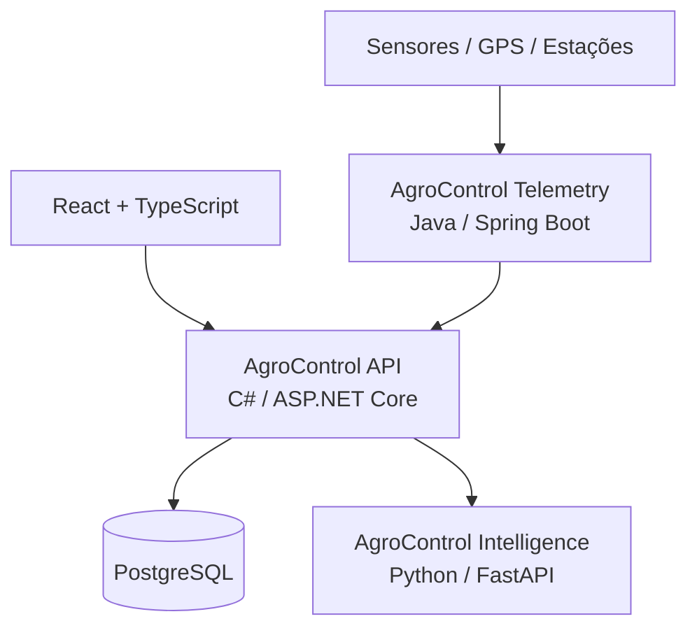

# AgroControl

**AgroControl** é uma plataforma modular para gestão e inteligência no agronegócio. O projeto começa como um **monólito modular em C# / ASP.NET Core**, mantendo pontos claros de integração com serviços especializados em **Python** (dados, IA e visão computacional) e **Java** (telemetria e IoT).

> Status atual: **Sprint 1 concluída — Identity, Organizations e acesso por módulos**

## Objetivo

Centralizar, em uma única plataforma, os principais fluxos de uma operação rural:

- gestão de propriedades e talhões;
- culturas e safras;
- estoque de insumos;
- custos e resultado financeiro;
- máquinas e manutenção;
- mercado e commodities;
- agricultura de precisão;
- análise de dados e IA;
- irrigação e sensores;
- sustentabilidade e carbono;
- exportação.

Os módulos podem ser liberados por plano. Recursos indisponíveis continuam visíveis na interface como **bloqueados** ou **em breve**, mas o bloqueio também é validado no backend.

## Stack

| Camada | Tecnologia |
|---|---|
| Frontend | React + TypeScript (planejado) |
| API principal | C# + ASP.NET Core / .NET 10 |
| Banco de dados | PostgreSQL |
| ORM | Entity Framework Core |
| Inteligência / Dados | Python + FastAPI (planejado) |
| Telemetria / IoT | Java + Spring Boot (planejado) |
| Autenticação | JWT |
| Containers | Docker / Docker Compose |
| Orquestração futura | Kubernetes |
| CI/CD | GitHub Actions |
| Observabilidade futura | OpenTelemetry + Grafana |

## Arquitetura



A API principal começa como um **monólito modular**. Python e Java só entram como serviços independentes quando houver uma justificativa técnica real.

## O que já funciona

- solução .NET 10 organizada em Domain, Application, Infrastructure e API;
- PostgreSQL com Entity Framework Core;
- migration inicial e factory de design-time;
- Organization, User e membership usuário-organização;
- papéis `Owner`, `Admin`, `Manager` e `Viewer`;
- cadastro e login com JWT;
- senha protegida com PBKDF2-HMAC-SHA512 e salt aleatório;
- planos `Basic`, `Pro`, `Intelligence` e `Enterprise`;
- entitlements e overrides por organização;
- retorno `403 Forbidden` para módulo não habilitado;
- Docker Compose com aplicação automática das migrations;
- testes unitários;
- CI com restore, build e test.

## Módulos

### Basic

Identity, Organizations, Farms, Fields, Crops, Seasons, Inventory e Finance.

### Pro

Tudo do Basic + Machinery, Market, Precision Agriculture, Irrigation e Sustainability.

### Intelligence

Tudo do Pro + Intelligence e Telemetry.

### Enterprise

Todos os módulos, incluindo Export.

Veja [`docs/MODULES.md`](docs/MODULES.md) e [`docs/SPRINT_1_IDENTITY.md`](docs/SPRINT_1_IDENTITY.md).

## Executando com Docker

1. Copie `.env.example` para `.env`.
2. Troque `JWT_KEY` e, se desejar, as credenciais locais do PostgreSQL.
3. Execute:

```bash
docker compose up --build
```

A API ficará em `http://localhost:8080`.

### Endpoints iniciais

```text
GET  /health
GET  /api/v1/platform/modules
POST /api/v1/auth/register
POST /api/v1/auth/login
GET  /api/v1/me
GET  /api/v1/organizations/current
GET  /api/v1/platform/entitlements
GET  /api/v1/platform/modules/{moduleKey}/access
```

Exemplo de cadastro:

```json
{
  "organizationName": "Fazenda Santa Clara",
  "displayName": "Administrador",
  "email": "admin@fazenda.local",
  "password": "TroqueEstaSenha123!"
}
```

O cadastro cria automaticamente a organização, o primeiro usuário como `Owner` e uma assinatura `Basic` ativa.

## Migrations

A migration inicial é `20260907002000_InitialIdentity`.

Para usar o EF CLI localmente, configure opcionalmente `AGROCONTROL_CONNECTION_STRING` e execute o comando apontando para o projeto de Infrastructure. O `AgroControlDbContextFactory` permite criar o contexto em design-time sem depender da inicialização da API.

No Docker Compose, as migrations são aplicadas automaticamente porque `Database__ApplyMigrations=true`.

## Segurança

A chave de `appsettings.Development.json` é apenas uma chave conhecida de desenvolvimento local. **Nunca use essa chave em produção.** Em ambientes reais, forneça `Jwt__Key` por secret/variável de ambiente segura.

## Roadmap resumido

1. ✅ **Sprint 0** — fundação, documentação, arquitetura, CI e containers.
2. ✅ **Sprint 1** — identidade, organizações, PostgreSQL e autorização por módulo.
3. ⏭️ **Sprint 2** — propriedades, talhões, culturas e safras.
4. **Sprint 3** — estoque.
5. **Sprint 4** — financeiro.
6. **Sprint 5** — máquinas e mercado.
7. **Sprint 6** — serviço Python de inteligência.
8. **Sprint 7** — serviço Java de telemetria.
9. **Sprint 8** — observabilidade, CI/CD avançado e Kubernetes.

Detalhes em [`docs/ROADMAP.md`](docs/ROADMAP.md).

## Licença

A licença ainda não foi definida. Não adicione uma licença pública ao projeto sem decidir antes o modelo de distribuição do AgroControl.
