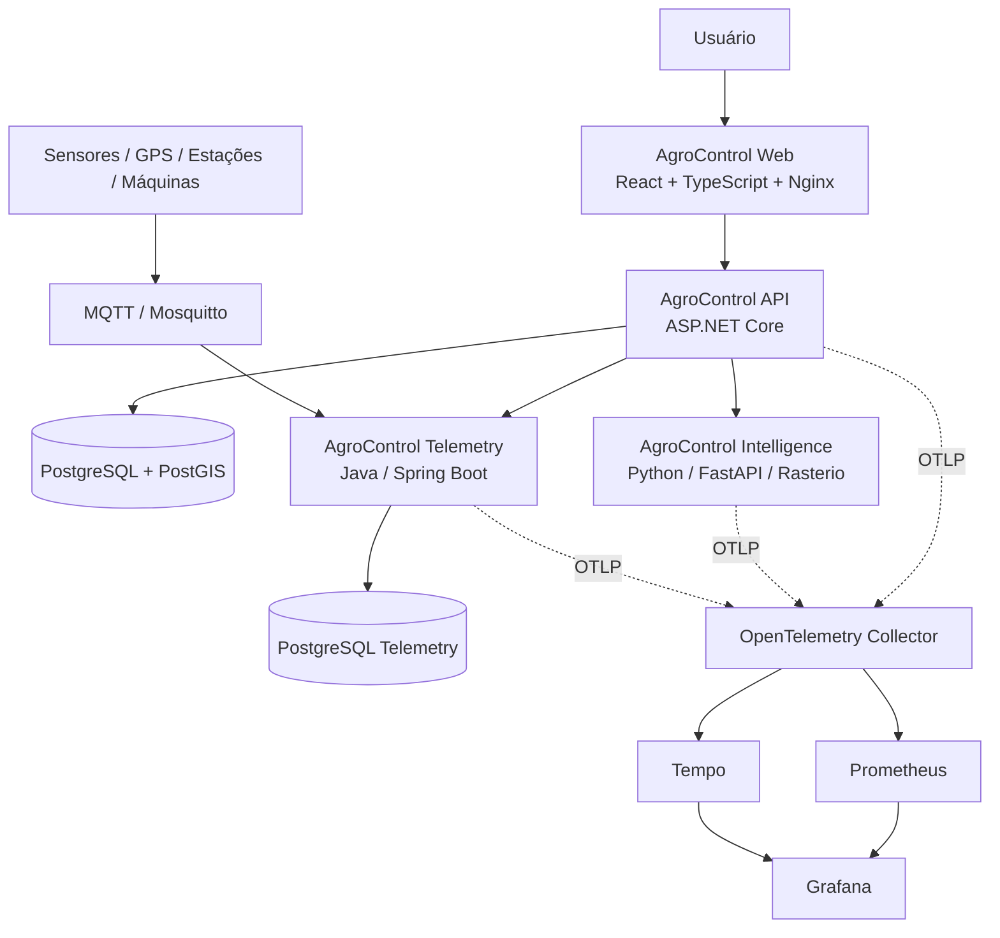

# Arquitetura do AgroControl

## 1. Visão geral

O AgroControl adota um **monólito modular em C# / ASP.NET Core** como núcleo transacional, complementado por serviços especializados quando existe uma fronteira técnica clara:

- **AgroControl Web** — React + TypeScript;
- **AgroControl API** — ASP.NET Core / .NET;
- **AgroControl Intelligence** — Python + FastAPI para modelagem e processamento científico;
- **AgroControl Telemetry** — Java + Spring Boot para ingestão e histórico de telemetria;
- **PostgreSQL + PostGIS** — persistência principal e dados espaciais;
- **PostgreSQL Telemetry** — persistência dedicada da telemetria;
- **MQTT / Mosquitto** — ingestão de eventos de dispositivos;
- **OpenTelemetry + Prometheus + Tempo + Grafana** — observabilidade;
- **Docker, GitHub Actions e Kubernetes/Kustomize** — execução e entrega.

O objetivo é manter fronteiras de domínio claras sem introduzir complexidade distribuída onde ela não é necessária.

## 2. Topologia



## 3. Backend C#

```text
AgroControl.Api
      │
      ▼
AgroControl.Application
      │
      ▼
AgroControl.Domain

AgroControl.Infrastructure
      ├── persistência EF Core/PostGIS
      ├── autenticação e integrações
      ├── clientes HTTP
      └── implementações de repositórios
```

### Domain

Entidades, regras, invariantes e conceitos do negócio. Não depende de HTTP, banco ou implementação de infraestrutura.

### Application

Casos de uso, contratos, DTOs, políticas de aplicação e orquestração. Coordena o domínio sem depender de detalhes concretos de persistência.

### Infrastructure

EF Core, PostgreSQL/PostGIS, autenticação, clientes externos, repositórios e integrações técnicas.

### API

Entrada HTTP, autenticação, filtros de entitlement/escopo e composição de dependências. Deve permanecer fina.

## 4. Multi-tenancy e escopo operacional

A arquitetura possui duas fronteiras cumulativas de autorização:

```text
OrganizationId — limite máximo do tenant
      │
      └── FarmAccessScope — limite operacional dentro da organização
              ├── AllFarms
              ├── Region
              └── Farm
```

`OrganizationId` continua impedindo qualquer cruzamento entre empresas/grupos. A Sprint 18 acrescenta `Farm` como fronteira horizontal dentro do mesmo tenant.

```text
Organization
├── OperationalRegion
│   ├── Farm A
│   │   ├── Field
│   │   └── Season
│   └── Farm B
└── Farm C
```

O papel organizacional (`Owner`, `Admin`, `Manager`, `Viewer`) e o escopo operacional são conceitos separados. `Owner/Admin` não recebem acesso global por inferência durante a leitura; `AllFarms` é um escopo explícito.

## 5. Autorização horizontal

A API resolve o escopo efetivo do usuário e inicializa um `OperationalScopeContext` por request.

A proteção é aplicada em profundidade:

1. `OrganizationId` restringe o tenant;
2. `FarmAccessScope` restringe as propriedades permitidas;
3. query filters do EF Core protegem entidades relacionais ligadas a fazenda;
4. SQL/PostGIS explícito recebe e aplica o mesmo escopo;
5. Telemetry valida Farm/Field/Machine na API C# antes de acessar o serviço Java;
6. IDs fora do escopo são tratados como inexistentes quando possível para reduzir enumeração;
7. migrations de backfill materializam `FarmId` em registros legados quando a fazenda pode ser inferida;
8. testes A × B na mesma organização exercitam a fronteira horizontal.

O frontend nunca é considerado mecanismo de segurança.

## 6. Módulos e entitlements

A disponibilidade funcional é controlada pelo backend por `ModuleKey` e plano/override da organização. O frontend pode mostrar módulos bloqueados, mas chamadas diretas à API continuam sujeitas ao mesmo entitlement.

Planos atuais:

- `Basic`;
- `Pro`;
- `Intelligence`;
- `Enterprise`.

O catálogo canônico de módulos por plano está em `PlanEntitlementCatalog`.

## 7. Persistência

O banco principal usa PostgreSQL + PostGIS e mantém ownership lógico por módulo. O raster pesado não é armazenado no banco relacional principal; ficam nele metadados, referências, lifecycle e estatísticas derivadas.

Telemetry possui PostgreSQL próprio porque o padrão de ingestão/eventos é diferente do núcleo transacional.

Convenções importantes:

- IDs em `Guid`;
- timestamps técnicos em UTC;
- `DateOnly` para datas agrícolas sem horário quando aplicável;
- dinheiro com `decimal` e moeda explícita quando necessário;
- geometrias WGS84/SRID 4326;
- timezone operacional em identificador IANA.

## 8. Geoespacial e raster

PostGIS é usado para limites de talhão, zonas de manejo, footprints e consultas espaciais. Trechos SQL que não passam por LINQ aplicam explicitamente `OrganizationId` e o escopo operacional.

O processamento científico de GeoTIFF/COG ocorre no AgroControl Intelligence com Rasterio/NumPy. A API C# mantém autorização, contexto produtivo, idempotência e persistência dos resultados.

## 9. Telemetria

AgroControl Telemetry recebe eventos via MQTT QoS 1 e mantém histórico append-only/idempotente. A API C# funciona como fronteira de autorização para os endpoints expostos ao produto, incluindo o escopo por propriedade.

Dispositivos podem ser vinculados a Farm, Field e Machine. Recursos explicitamente organizacionais sem esses vínculos permanecem no escopo do tenant.

## 10. Web e contexto multi-fazenda

A Web mantém o contexto operacional da organização durante a sessão e oferece seleção por:

- todas as fazendas, quando permitido;
- região operacional;
- UF;
- fazenda.

O dashboard e o mapa multi-fazenda usam somente propriedades acessíveis. O mapa usa MapLibre e ajusta o enquadramento ao conjunto visível.

Datas operacionais são apresentadas no timezone da fazenda quando existe uma única propriedade ativa; consolidações entre propriedades preservam o instante UTC e o contexto local.

## 11. Segurança

Princípios atuais:

- JWT e autorização no backend;
- isolamento por organização e fazenda;
- entitlement validado na API;
- secrets fora do repositório;
- validação de input e integridade de referências;
- redução de enumeração de IDs fora do escopo;
- logs sem segredos/dados sensíveis desnecessários;
- least privilege;
- CodeQL e Dependabot;
- assets raster remotos desabilitados por padrão;
- testes de autorização cross-tenant e horizontal.

## 12. Observabilidade e plataforma

Observabilidade já faz parte da plataforma:

- OpenTelemetry nos serviços C#, Python e Java;
- Prometheus para métricas;
- Tempo para tracing;
- Grafana para visualização;
- health/readiness probes;
- Docker Compose para stack integrada;
- Kubernetes + Kustomize;
- Platform CI com smoke tests e observabilidade.

## 13. CI/CD

Os principais gates do repositório são:

- Backend CI;
- Intelligence CI;
- Telemetry CI;
- Frontend CI;
- Platform CI;
- CodeQL;
- Dependabot.

A Sprint 18 foi fechada somente após Backend, Frontend, Platform e CodeQL passarem no mesmo head do PR #51.

## 14. Estado atual

A arquitetura está consolidada até a **Sprint 18 — Operação multi-fazenda**, com API `0.18.0`.

A próxima evolução deve preservar as fronteiras já estabelecidas: tenant, escopo operacional, módulo/entitlement e responsabilidades específicas de C#, Python e Java.