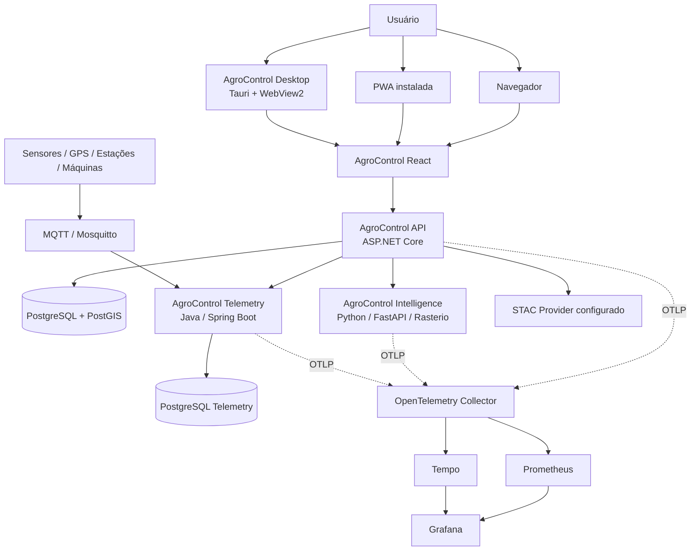

# Arquitetura do AgroControl

## 1. Visão geral

O AgroControl adota um **monólito modular em C# / ASP.NET Core** como núcleo transacional, complementado por serviços especializados somente quando existe uma fronteira técnica clara.

A interface canônica é uma única aplicação **React + TypeScript + Vite**, distribuída em três superfícies sem duplicação de produto:

- navegador;
- PWA instalável;
- Desktop Windows via Tauri.

Serviços da plataforma:

- **AgroControl API** — ASP.NET Core / .NET;
- **AgroControl Intelligence** — Python + FastAPI para modelagem e processamento científico;
- **AgroControl Telemetry** — Java + Spring Boot para ingestão e histórico de telemetria;
- **PostgreSQL + PostGIS** — persistência principal e dados espaciais;
- **PostgreSQL Telemetry** — persistência dedicada da telemetria;
- **MQTT / Mosquitto** — ingestão de eventos de dispositivos;
- **OpenTelemetry + Prometheus + Tempo + Grafana** — observabilidade;
- **Docker, GitHub Actions e Kubernetes/Kustomize** — execução e entrega;
- **STAC providers externos** — descoberta de cenas geoespaciais por catálogo configurado.

O objetivo é manter fronteiras de domínio claras sem introduzir complexidade distribuída onde ela não é necessária.

## 2. Topologia



No deployment Web, Nginx serve o build React e funciona como proxy same-origin para a API. No Desktop, o mesmo build React roda dentro do WebView do Tauri e acessa a API por uma origem configurada, sujeita a CORS explícito.

## 3. Backend C#

```text
AgroControl.Api
      │
      ▼
AgroControl.Application
      │
      ▼
AgroControl.Domain

AgroControl.Infrastructure
      ├── persistência EF Core/PostGIS
      ├── autenticação e integrações
      ├── clientes HTTP
      └── implementações de repositórios
```

### Domain

Entidades, regras, invariantes e conceitos do negócio. Não depende de HTTP, banco ou implementação de infraestrutura.

### Application

Casos de uso, contratos, DTOs, políticas de aplicação e orquestração. Coordena o domínio sem depender de detalhes concretos de persistência.

### Infrastructure

EF Core, PostgreSQL/PostGIS, autenticação, clientes externos, repositórios e integrações técnicas.

### API

Entrada HTTP, autenticação, filtros de entitlement/escopo e composição de dependências. Deve permanecer fina.

## 4. Multi-tenancy e escopo operacional

A arquitetura possui duas fronteiras cumulativas de autorização:

```text
OrganizationId — limite máximo do tenant
      │
      └── FarmAccessScope — limite operacional dentro da organização
              ├── AllFarms
              ├── Region
              └── Farm
```

`OrganizationId` impede cruzamento entre organizações. `FarmAccessScope` restringe a operação horizontal dentro do mesmo tenant.

```text
Organization
├── OperationalRegion
│   ├── Farm A
│   │   ├── Field
│   │   └── Season
│   └── Farm B
└── Farm C
```

O papel organizacional (`Owner`, `Admin`, `Manager`, `Viewer`) e o escopo operacional são conceitos separados. O backend resolve o escopo efetivo por request.

## 5. Autorização horizontal

A API inicializa um `OperationalScopeContext` por request e aplica proteção em profundidade:

1. `OrganizationId` restringe o tenant;
2. `FarmAccessScope` restringe propriedades permitidas;
3. query filters do EF Core protegem entidades relacionais ligadas à fazenda;
4. SQL/PostGIS explícito recebe e aplica o mesmo escopo;
5. Telemetry valida Farm/Field/Machine na API C# antes de acessar o serviço Java;
6. IDs fora do escopo são tratados como inexistentes quando possível;
7. migrations/backfills materializam `FarmId` quando necessário;
8. testes Fazenda A × Fazenda B exercitam a fronteira horizontal.

Navegador, PWA e Tauri são clientes. Nenhum deles é considerado mecanismo de autorização.

## 6. Módulos e entitlements

A disponibilidade funcional é controlada pelo backend por `ModuleKey` e plano/override da organização. O frontend pode mostrar módulos bloqueados, mas chamadas diretas à API continuam sujeitas ao mesmo entitlement.

Planos atuais:

- `Basic`;
- `Pro`;
- `Intelligence`;
- `Enterprise`.

O catálogo canônico de módulos por plano está em `PlanEntitlementCatalog`.

## 7. Persistência

O banco principal usa PostgreSQL + PostGIS e mantém ownership lógico por módulo. Raster pesado não é armazenado no banco relacional principal; ficam metadados, referências, lifecycle e estatísticas derivadas.

Telemetry possui PostgreSQL próprio porque o padrão de ingestão/eventos é diferente do núcleo transacional.

Convenções:

- IDs em `Guid`;
- timestamps técnicos em UTC;
- `DateOnly` para datas agrícolas sem horário quando aplicável;
- dinheiro com `decimal` e moeda explícita quando necessário;
- geometrias WGS84/SRID 4326;
- timezone operacional em identificador IANA.

O Desktop da Sprint 20 não adiciona banco local. Sincronização offline futura deverá possuir desenho próprio de armazenamento, fila, versão e resolução de conflitos.

## 8. Geoespacial, sensoriamento remoto e raster

PostGIS é usado para limites de talhão, zonas de manejo, footprints e consultas espaciais. Trechos SQL fora de LINQ aplicam explicitamente `OrganizationId` e o escopo operacional.

O processamento científico de GeoTIFF/COG ocorre no AgroControl Intelligence com Rasterio/NumPy. A API C# mantém autorização, contexto produtivo, idempotência e persistência dos resultados.

`RemoteSensingScene` permanece o modelo canônico persistido para cenas.

## 9. Descoberta STAC

A Sprint 19 adiciona uma camada externa de descoberta sem criar um novo domínio persistente.

```text
Web / PWA / Desktop
  ↓
RemoteSceneDiscoveryEndpoints
  ↓
RemoteSceneDiscoveryService
  ├── Field/Season + FarmAccessScope
  ↓
IRemoteSceneDiscoveryClient
  ↓
StacRemoteSceneDiscoveryClient
  ↓
Provider STAC configurado
```

Princípios arquiteturais:

- o cliente envia `FieldId`, filtros e escolha do item/asset, nunca a URL do catálogo;
- a geometria enviada ao provider é carregada do boundary canônico do Field no backend;
- providers são definidos por configuração server-side;
- busca é transitória e não persiste todos os itens externos;
- importação reconsulta o item pelo backend usando `Provider + Collection + ExternalId`;
- o cliente só aceita `AssetKey` que tenha sido normalizado como raster elegível;
- `Provider + ExternalId` reaproveita a idempotência de `RemoteSensingScene`;
- importação e processamento raster permanecem passos separados.

### Segurança de rede STAC

- HTTPS fora de loopback/local controlado;
- credenciais embutidas em URL são rejeitadas;
- query strings são removidas das referências normalizadas de assets;
- paginação só segue continuação same-origin/same-path;
- limite de resposta e timeout;
- nenhum download de asset durante descoberta;
- falha do provider não compromete o restante de Remote Sensing.

### Observabilidade STAC

O meter `AgroControl.RemoteSceneDiscovery` mede buscas, latência, volume de resultados e importações.

Labels são limitadas a provider configurado e outcome. IDs de item, URL, `farmId`, `userId` e tokens não entram como labels.

## 10. Telemetria

AgroControl Telemetry recebe eventos via MQTT QoS 1 e mantém histórico append-only/idempotente. A API C# funciona como fronteira de autorização para os endpoints expostos ao produto, incluindo o escopo por propriedade.

Dispositivos podem ser vinculados a Farm, Field e Machine. Recursos explicitamente organizacionais sem esses vínculos permanecem no escopo do tenant.

## 11. Web, PWA e contexto multi-fazenda

A SPA React mantém o contexto operacional durante a sessão e oferece seleção por:

- todas as fazendas, quando permitido;
- região operacional;
- UF;
- fazenda.

O dashboard e o mapa multi-fazenda usam somente propriedades acessíveis. O mapa usa MapLibre e ajusta o enquadramento ao conjunto visível.

A descoberta STAC está integrada ao workspace de Sensoriamento Remoto, com filtros, resultados paginados, footprint no mapa e importação explícita.

Datas operacionais são apresentadas no timezone da fazenda quando existe uma única propriedade ativa; consolidações preservam o instante UTC e o contexto local.

A PWA adiciona apenas instalação e cache do app shell. O service worker exclui `/api` e `/health`, portanto dados autenticados de negócio não são transformados em cache offline nesta fase.

## 12. Desktop Tauri

A Sprint 20 introduz um shell Tauri v2 para Windows, mantendo a aplicação React como única interface.

```text
Tauri / WebView2
      │
      └── dist/ React/Vite
              │
              └── HTTPS → AgroControl API
```

Princípios:

- nenhum backend C#, PostgreSQL, Python ou Java é empacotado no instalador;
- nenhum comando Rust privilegiado é exposto ao JavaScript na fase inicial;
- `withGlobalTauri=false`;
- capabilities começam vazias;
- DevTools ficam desabilitadas na distribuição;
- CSP declara hosts permitidos;
- `VITE_API_BASE_URL` define a API para o build desktop;
- a origem Windows `http://tauri.localhost` é permitida na API por CORS explícito;
- não há `AllowAnyOrigin`;
- JWT continua em `sessionStorage`, sem persistência nativa nova;
- o service worker PWA não é registrado dentro do Tauri.

O Desktop CI gera bundles NSIS `.exe` e MSI `.msi`. Enquanto não houver certificado de code signing, esses artefatos são classificados como builds de validação não assinados, não como distribuição pública oficial.

## 13. Segurança

Princípios atuais:

- JWT e autorização no backend;
- isolamento por organização e fazenda;
- entitlement validado na API;
- secrets fora do repositório;
- validação de input e integridade de referências;
- redução de enumeração de IDs fora do escopo;
- logs sem segredos/dados sensíveis desnecessários;
- least privilege;
- CodeQL e Dependabot;
- assets raster remotos desabilitados por padrão no Intelligence;
- STAC providers permitidos por configuração server-side;
- CORS por allowlist para clientes cross-origin permitidos;
- CSP explícita no shell Tauri;
- testes cross-tenant e horizontais.

## 14. Observabilidade e plataforma

- OpenTelemetry nos serviços C#, Python e Java;
- Prometheus para métricas;
- Tempo para tracing;
- Grafana para visualização;
- health/readiness probes;
- Docker Compose para stack integrada;
- Kubernetes + Kustomize;
- Platform CI com smoke tests e observabilidade.

## 15. CI/CD

Principais gates:

- Backend CI;
- Intelligence CI;
- Telemetry CI;
- Frontend CI;
- Desktop CI Windows;
- Platform CI;
- CodeQL;
- Dependabot.

A partir da Sprint 20, mudanças na distribuição instalável só são encerradas depois de **Frontend CI + Desktop CI + Backend CI + Platform CI + CodeQL** verdes no mesmo head final.

O Desktop CI usa runner Windows e constrói os bundles Tauri da mesma SPA usada pela Web. Assinatura de código e atualização automática permanecem bloqueadas até existir estratégia de distribuição de produção e certificado real.

## 16. Estado atual

A arquitetura funcional está consolidada até a **Sprint 19 — STAC e descoberta de cenas**, com API `0.19.0`. A Sprint 20 adiciona as superfícies instaláveis PWA/Tauri sem alterar as fronteiras do backend.

As próximas evoluções devem preservar: tenant, escopo operacional, módulo/entitlement, confiança de integrações externas, separação cliente/servidor e responsabilidades específicas de C#, Python e Java.
