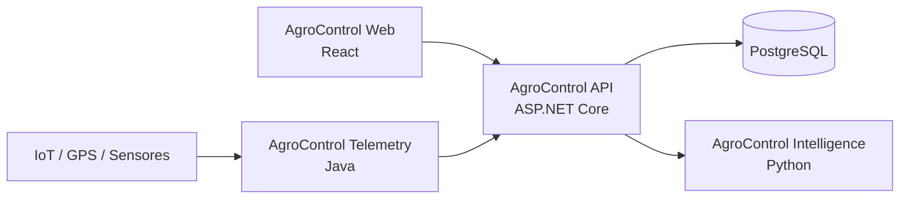

# Arquitetura do AgroControl

## 1. Princípio central

O AgroControl começa como um **monólito modular** para evitar complexidade distribuída prematura. A aplicação deve manter fronteiras claras entre módulos para permitir evolução futura sem transformar o sistema em um conjunto de dependências acopladas.

## 2. Componentes



### API principal

Responsável por identidade, organizações, propriedades, talhões, culturas, safras, estoque, financeiro, máquinas, autorizações, planos, módulos e coordenação das integrações.

### Intelligence

Serviço Python especializado. Não deve virar um segundo backend genérico. Recebe dados do AgroControl, processa e devolve resultados analíticos.

### Telemetry

Serviço Java especializado em ingestão e normalização de eventos de dispositivos.

## 3. Camadas do backend C#

```text
AgroControl.Api
      │
      ▼
AgroControl.Application
      │
      ▼
AgroControl.Domain

AgroControl.Infrastructure
      ├── implementa recursos externos
      ├── depende de Application/Domain
      └── é consumida pela API
```

### Domain

Contém entidades, value objects, invariantes e conceitos do negócio. Não conhece banco, HTTP ou frameworks de infraestrutura.

### Application

Orquestra casos de uso e contratos da aplicação. Conhece o domínio, mas não detalhes concretos de infraestrutura.

### Infrastructure

Implementa persistência, integrações, autenticação e recursos externos.

### API

Camada de entrada HTTP. Deve permanecer fina.

## 4. Multi-tenancy

O modelo inicial será orientado por `Organization`.

```text
User
  └── Organization
        ├── Farm A
        │    ├── Field 1
        │    └── Field 2
        └── Farm B
```

As consultas de negócio devem respeitar o escopo da organização autenticada.

## 5. Módulos e entitlement

O acesso a módulos será controlado por backend. O frontend pode exibir um módulo bloqueado, mas uma chamada direta à API também deverá ser recusada quando o módulo não estiver habilitado.

## 6. Integração entre componentes

Fase inicial: HTTP/REST síncrono. Mensageria só será introduzida quando houver necessidade real, por exemplo grande volume de telemetria, processamento de imagem demorado ou eventos assíncronos.

## 7. Banco de dados

Inicialmente, um PostgreSQL compartilhado pela aplicação principal, com ownership lógico por módulos. Bancos separados só serão considerados se os limites operacionais realmente justificarem.

## 8. Segurança

- autenticação moderna baseada em tokens;
- autorização por organização e módulo;
- secrets fora do repositório;
- validação de input;
- logs sem dados sensíveis;
- least privilege;
- auditoria de operações relevantes.

## 9. Observabilidade

Futuro: logs estruturados, métricas, tracing distribuído, OpenTelemetry e Grafana.
