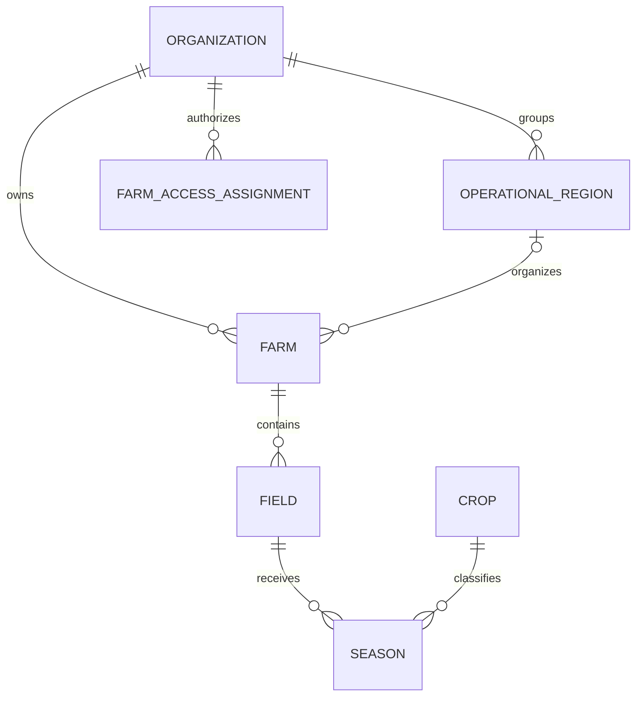

# Modelo de domínio do AgroControl

## Limites principais

### Organization

Representa a empresa ou grupo rural dentro do AgroControl e continua sendo o **limite máximo de isolamento multi-tenant**. Nenhum dado de negócio pode atravessar `OrganizationId`.

### OperationalRegion

Agrupa propriedades de uma organização para gestão regional. Uma região pode conter fazendas de um ou vários estados e não cria um novo tenant.

### Farm

Representa uma propriedade rural pertencente a uma organização e, a partir da Sprint 18, também funciona como **fronteira operacional de autorização**. A propriedade possui localização estruturada, região opcional, coordenadas opcionais e timezone IANA.

### FarmAccessAssignment

Define explicitamente o escopo operacional de um usuário dentro da organização:

- `AllFarms` — todas as propriedades;
- `Region` — propriedades integrantes da região;
- `Farm` — uma propriedade específica.

O papel organizacional (`Owner`, `Admin`, `Manager`, `Viewer`) e o escopo operacional são conceitos diferentes. Papel define capacidade administrativa; escopo define quais propriedades podem ser vistas/manipuladas.

### Field

Representa um talhão ou área produtiva de uma propriedade.

### Crop

Catálogo de culturas agrícolas, por exemplo soja, milho, café e algodão.

### Season

Representa uma safra/ciclo produtivo de uma cultura em um talhão.

## Relações centrais



## Autorização horizontal

O acesso segue duas fronteiras cumulativas:

```text
Tenant: OrganizationId
        ↓
Operação: Farm scope efetivo
        ↓
Farm / Field / Season e módulos relacionados
```

Um usuário pode pertencer à mesma organização de outra fazenda e ainda assim não possuir acesso a ela. Consultas por ID, filtros, contagens e agregações devem respeitar essa restrição no backend.

Registros realmente organizacionais que não pertencem a uma propriedade podem continuar visíveis no tenant quando o domínio explicitamente admite `FarmId = null`. Isso não autoriza acesso indireto a dados vinculados a uma propriedade fora do escopo.

## Localização da propriedade

A propriedade mantém `City`/`State` por compatibilidade e acrescenta:

- `CountryCode` ISO 3166-1 alpha-2;
- `StateCode`/UF normalizado;
- `MunicipalityCode` opcional;
- `PostalCode` opcional;
- `Latitude`/`Longitude` opcionais;
- `OperationalRegionId` opcional;
- `TimeZoneId` IANA obrigatório.

Eventos permanecem em UTC. O timezone da propriedade é contexto de apresentação e de interpretação do dia operacional.

## Regras transversais

- uma propriedade pertence a uma única organização;
- uma região operacional pertence a uma única organização;
- vínculos Region/Farm nunca podem atravessar tenant;
- um talhão pertence a uma única propriedade;
- áreas usam unidade explícita;
- uma safra deve ter cultura e período válidos;
- dinheiro usa `decimal` e moeda explícita quando o módulo suporta múltiplas moedas;
- estoque usa ledger de movimentações;
- históricos relevantes preferem append-only, inativação ou soft delete conforme o caso;
- segurança nunca depende apenas da interface web;
- SQL/PostGIS explícito deve aplicar o mesmo escopo operacional das consultas EF Core.

## Convenções de dados

- IDs: `Guid`;
- timestamps: UTC;
- datas agrícolas sem horário: `DateOnly` quando aplicável;
- dinheiro: `decimal`;
- quantidades: `decimal` + unidade explícita;
- geometrias: WGS84 / SRID 4326 quando aplicável;
- timezone: identificador IANA;
- idioma do código: inglês.
