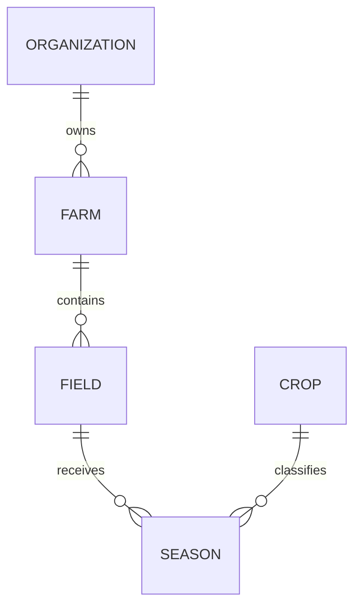

# Modelo de domínio inicial

## Agregados centrais planejados

### Organization

Representa o cliente/empresa/grupo dentro do AgroControl. É o principal limite de isolamento de dados.

### Farm

Representa uma propriedade rural pertencente a uma organização.

### Field

Representa um talhão ou área produtiva de uma propriedade.

### Crop

Catálogo de culturas agrícolas, por exemplo soja, milho, café e algodão.

### Season

Representa uma safra/ciclo produtivo de uma cultura em um talhão.

## Relações iniciais

## Regras que serão definidas nos próximos sprints

- uma propriedade pertence a uma única organização;
- um talhão pertence a uma única propriedade;
- áreas devem usar unidade explícita;
- uma safra deve ter cultura e período válidos;
- lançamentos financeiros devem manter moeda e precisão adequadas;
- estoque deve ser controlado por movimentações, evitando apenas sobrescrever saldo;
- exclusões com histórico importante deverão preferir inativação/soft delete quando adequado.

## Convenções de dados

- IDs: `Guid`;
- timestamps: UTC;
- dinheiro: `decimal`;
- datas agrícolas sem horário: `DateOnly` quando aplicável;
- quantidades: `decimal` + unidade explícita;
- idioma do código: inglês.
